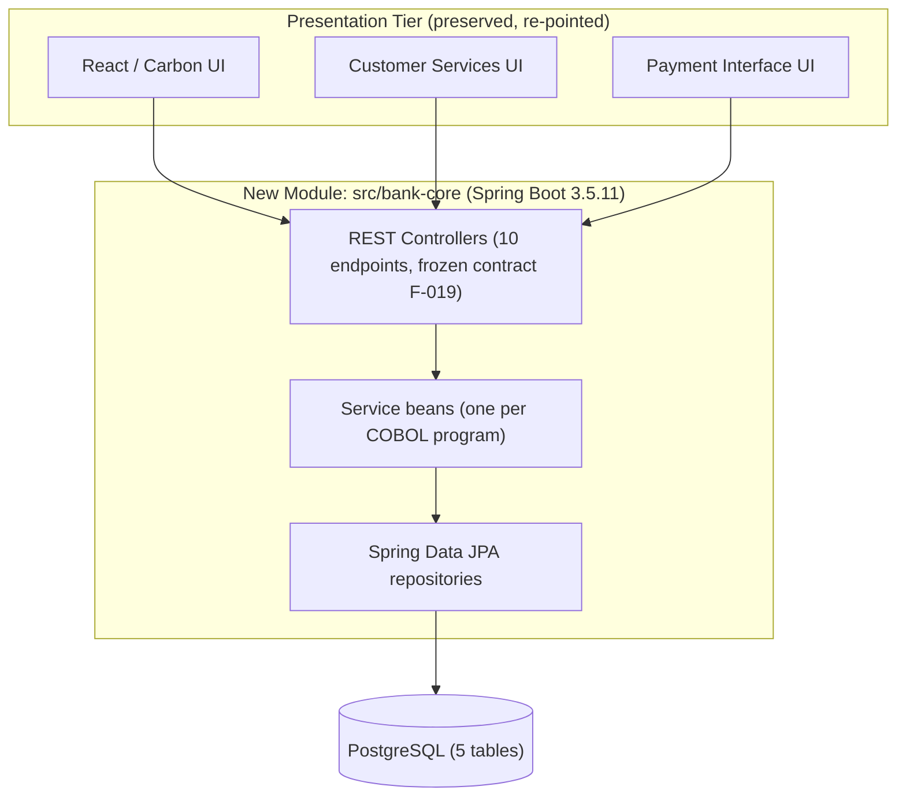
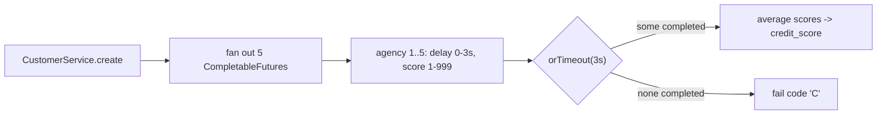

# Technical Specification

# 0. Agent Action Plan

## 0.1 Intent Clarification

This Agent Action Plan translates the user's migration request into a precise, file-level engineering specification for the Blitzy platform. It restates the intent in technical terms, surfaces the implicit requirements that the prompt implies but does not spell out, and binds every objective to concrete source and target artifacts in the repository. The existing COBOL is treated as the authoritative behavioral specification; the existing Java is treated as a thin presentation/API layer to be re-pointed.

### 0.1.1 Core Refactoring Objective

Based on the prompt, the Blitzy platform understands that the refactoring objective is to reimplement the business logic of the IBM CICS Bank Sample Application (CBSA) — currently expressed as approximately 25,650 lines of COBOL across 29 programs [src/base/cobol_src/*.cbl] running under CICS Transaction Server 6.1 against Db2 and VSAM on z/OS — as a new, standalone, pure-Java application built on Spring Boot 3.5.11 (Java 17) and backed by PostgreSQL, with no mainframe, CICS, or z/OS Connect component in the target runtime.

- **Refactoring type:** Tech stack migration is the dominant axis (COBOL/CICS/Db2/VSAM → Java/Spring Boot/PostgreSQL), combined with a structural and modularity refactor that recasts procedural, record-oriented COBOL into a layered, object-oriented Java architecture.
- **Target repository:** Same repository. The word "standalone" denotes a new, self-contained Spring Boot Maven module added under `src/` and registered in the root reactor `pom.xml` `<modules>` block [pom.xml:L30-L34], alongside the existing `customerservices`, `paymentinterface`, and `webui` modules. It is not a separate-repository migration.

The discrete refactoring goals, restated with engineering clarity, are:

- Translate each COBOL business program into an equivalent Java service that preserves its behavior, fail codes, and validation rules exactly, because the COBOL is the authoritative specification of record (preserve behavior first, refactor second).
- Replace the VSAM KSDS and Db2 persistence with a single PostgreSQL store, modeling the five core record layouts — ACCOUNT, CUSTOMER, PROCTRAN, ACCTCTRL, CUSTCTRL — as JPA entities (§6.2).
- Preserve the frozen z/OS Connect REST contract of ten endpoints (feature F-019, §2.1) so the existing React/Carbon front end and the Spring Boot interface modules require only a base-URL re-point rather than a rewrite.
- Decommission every IBM mainframe dependency: the CICS Transaction Server BOM, JCICS (`com.ibm.cics.server`), IBM JZOS, the WebSphere JSON API, and `cics-bundle-maven-plugin` (§3.7).

Implicit requirements surfaced from the prompt that the Blitzy platform will honor even though they are not stated literally:

- **API compatibility is mandatory, not optional.** Because two front ends consume the contract — the React/Carbon UI through the `webui` adapter at `/webui-1.0/banking/*` [src/bank-application-frontend/.env:L1-L2] and the interface modules through the z/OS Connect endpoints [src/Z-OS-Connect-Customer-Services-Interface/.../controllers/WebController.java] — the JSON envelopes, field names, HTTP methods, and paths must be reproduced verbatim.
- **Gap-free identity numbering with rollback must be preserved.** The COBOL allocates account and customer numbers from control records with explicit get/current/rollback semantics [src/base/cobol_copy/NEWACCNO.cpy:L7-L13]; the target must reproduce this with a transactional counter rather than a database identity/sequence.
- **The two account balances must remain distinct.** `ACCOUNT-AVAILABLE-BALANCE` and `ACCOUNT-ACTUAL-BALANCE` [src/base/cobol_copy/ACCOUNT.cpy:L34-L35] carry independent meaning (cleared vs. pending) and must not be collapsed.
- **PROCTRAN is an append-only audit log with logical delete.** Physical deletion is forbidden (ADR-006, §6.2).
- **Net-new schema-migration tooling is required.** Flyway (or Liquibase) has no COBOL counterpart but is necessary to materialize the relational schema (§6.2).
- **All monetary arithmetic uses `BigDecimal` with `RoundingMode.HALF_UP`; floating-point types are prohibited**, per the user's instruction to "use BigDecimal for all money; match COBOL rounding exactly. Avoid double."

### 0.1.2 Technical Interpretation

This refactoring translates to the following technical transformation strategy: each architectural layer of the legacy z/OS stack is mapped to a Spring Boot equivalent, the COBOL file-control and SYNCPOINT model is replaced by Spring Data JPA under declarative transactions, and the fixed-format copybook records become typed JPA entities — all while the externally visible REST contract is frozen so that no consumer is disturbed.

The target is a layered, modular monolith (§5.1): a presentation tier (the preserved UIs), a REST controller tier honoring the frozen contract, a service tier with one bean per COBOL business program, a Spring Data JPA repository tier, and a single PostgreSQL database.



The per-layer transformation mapping that governs the migration (§3.7) is:

| Legacy Layer (z/OS) | Target Layer (Java) | Transformation Rule |
|---------------------|---------------------|---------------------|
| COBOL programs under CICS TS 6.1 | Spring `@Service` beans (Java 17 / Spring Boot 3.5.11) | One service per business program; preserve logic and fail codes |
| WebSphere Liberty | Embedded Tomcat | Standard Spring Boot packaging (JAR/WAR) |
| z/OS Connect EE API gateway | Native Spring MVC `@RestController` | Reproduce 10 API packages [src/zosconnect_artefacts/apis/*]; contract frozen |
| `EXEC CICS RUN TRANSID` on channel CIPCREDCHANN | `CompletableFuture` fan-out with 3-second deadline | Async credit-agency simulation (F-017) |
| Db2 v12+ and VSAM KSDS | PostgreSQL (single store) | Five record copybooks → five tables |
| Embedded SQL / CICS file control | Spring Data JPA + Hibernate | Repository pattern; `@Transactional` boundaries |
| IBM JZOS record generator | Plain Java DTOs + JPA entities | Drop fixed-format binding |
| BMS map sets | Dropped at runtime | Field validation retained as Bean Validation (F-021) |
| React/Carbon front end | Unchanged | Base-URL re-point only |

The cross-cutting transformation rules applied uniformly across the codebase are:

- **Money:** COBOL `S9(...)V99` → `java.math.BigDecimal` at scale 2 with `RoundingMode.HALF_UP`; PostgreSQL `NUMERIC(12,2)` for balances and amounts, `NUMERIC(6,2)` for interest rate (ADR-005, §6.2).
- **Dates:** COBOL `9(8)` → `java.time.LocalDate`; time `9(6)` → `java.time.LocalTime`.
- **Identity:** `NEWACCNO`/`NEWCUSNO` get/current/rollback flags → a `@Transactional` counter-row update under a pessimistic row lock; database `GENERATED AS IDENTITY` and `SEQUENCE` are forbidden because they cannot roll back a consumed value (ADR-003, §6.2).
- **Eye-catchers:** the `ACCT`/`CUST`/`PRTR`/`CTRL` marker fields are dropped; relational typing supersedes them (§3.7).
- **Transactions:** `EXEC CICS SYNCPOINT`/`ROLLBACK` [src/base/cobol_src/XFRFUN.cbl:L407-L408] → Spring `@Transactional` (propagation REQUIRED, isolation READ_COMMITTED).
- **Asynchrony:** the five credit-agency programs → `CompletableFuture` tasks with `orTimeout(3, SECONDS)` and score averaging (F-006/F-017, §5.1).
- **Screen handling:** BMS map sets are dropped; only their field-validation rules survive as annotations (F-021).


## 0.2 Scope Boundaries

This section draws the exhaustive boundary of the refactor. In-scope items are expressed with trailing wildcard patterns where a group of files is affected; out-of-scope items are listed explicitly so that no consumer, artifact, or behavior is altered unintentionally. The legacy COBOL, copybooks, and BMS maps are deliberately retained unmodified as the authoritative behavioral reference (§3.7) and therefore appear under reference usage rather than under files that are edited.

### 0.2.1 Exhaustively In Scope

**New standalone Java module (all CREATE).** A new Spring Boot Maven module rooted at `src/bank-core/` (package `com.ibm.cics.cip.bank.core`) is created in full:

- `src/bank-core/src/main/java/com/ibm/cics/cip/bank/core/**` — application bootstrap, configuration, constants, domain enums, JPA entities and embedded-key classes, repositories, services, REST controllers, DTOs, and exception handling.
- `src/bank-core/src/main/resources/application.yml` — datasource, JPA, async, and Flyway configuration.
- `src/bank-core/src/main/resources/db/migration/*.sql` — Flyway schema-creation and seed migrations.
- `src/bank-core/src/test/java/**` — service parity tests and controller contract tests.
- `src/bank-core/pom.xml` — module build descriptor.

**Source transformations driven by the COBOL specification (CREATE, referencing existing COBOL).** Each target Java file is generated by reading the corresponding COBOL artifact as its specification:

- The five record copybooks become JPA entities — ACCOUNT, CUSTOMER, PROCTRAN, ACCTCTRL, CUSTCTRL [src/base/cobol_copy/ACCOUNT.cpy, CUSTOMER.cpy, PROCTRAN.cpy, ACCTCTRL.cpy, CUSTCTRL.cpy].
- The thirteen business programs become service beans [src/base/cobol_src/CRECUST.cbl, CREACC.cbl, INQCUST.cbl, INQACC.cbl, INQACCCU.cbl, UPDCUST.cbl, UPDACC.cbl, DELCUS.cbl, DELACC.cbl, DBCRFUN.cbl, XFRFUN.cbl, GETCOMPY.cbl, GETSCODE.cbl].
- The five credit-agency programs collapse into one asynchronous service [src/base/cobol_src/CRDTAGY1.cbl through CRDTAGY5.cbl].
- The commarea/interface copybooks become request and response DTOs [src/base/cobol_copy/CRECUST.cpy, CREACC.cpy, INQACC.cpy, INQACCZ.cpy, INQACCCU.cpy, INQACCCZ.cpy, INQCUST.cpy, INQCUSTZ.cpy, UPDACC.cpy, UPDCUST.cpy, DELACC.cpy, DELACCZ.cpy, DELCUS.cpy, PAYDBCR.cpy].

**Configuration updates (UPDATE).**

- `pom.xml` (root) — register the new `<module>src/bank-core</module>` [pom.xml:L30-L34] and begin decommissioning the CICS Transaction Server BOM import [pom.xml:L20-L29].
- `src/Z-OS-Connect-Customer-Services-Interface/src/main/resources/application.properties` and `src/Z-OS-Connect-Payment-Interface/src/main/resources/application.properties` — re-point the backend host/port to the new module.

**Documentation updates.**

- `README.md` and `doc/**` — note the new module and the Java/PostgreSQL build path (secondary priority).

**Rule-mandated files (CREATE).** The prompt's binding translation constraints require artifacts with no COBOL counterpart, which are therefore explicitly in scope:

- `src/bank-core/src/main/resources/db/migration/V1__create_core_tables.sql` and `V2__seed_control_rows.sql` — the relational schema and initial control-row seeds.
- `src/bank-core/src/main/resources/application.yml` — PostgreSQL connection (`jdbc:postgresql://${DB_HOST:localhost}:5432/cbsa`, user/password `cbsa`) as described in the setup instructions.

### 0.2.2 Explicitly Out of Scope

- **The COBOL programs, copybooks, and BMS maps are not edited or deleted.** They are retained verbatim as the authoritative behavioral specification and serve only as reference inputs [src/base/cobol_src/*.cbl, src/base/cobol_copy/*.cpy, src/base/bms_src/*.bms] (§3.7).
- **All mainframe and CICS runtime concerns are excluded from the target.** `EXEC CICS` command-level calls, JCICS (`com.ibm.cics.server`), the IBM JZOS record generator, z/OS Connect EE server definitions, WebSphere Liberty `server.xml`, and the `etc/` installation JCL are removed from the runtime or retained as reference documentation only (§3.7).
- **The legacy Db2 DDL copybooks are reference only** [src/base/cobol_copy/ACCDB2.cpy, PROCDB2.cpy, CONTDB2.cpy]; the relational schema is materialized through Flyway and JPA, not through these artifacts.
- **The BMS terminal user interface is dropped.** Only the field-level validation rules embedded in the maps are carried forward as Bean Validation annotations (F-021); the 3270 screen flow itself is not reimplemented.
- **The React/Carbon front end is not redesigned.** It is preserved as-is [src/bank-application-frontend/package.json:L26-L44]; only the API base URL is re-pointed. No component, design-token, or layout changes are made, and consequently no full design-system compliance catalog is produced (see 0.3.4).
- **No new external infrastructure is introduced** — no cache, message broker, or third-party SaaS — consistent with the existing architecture (§5.1).
- **No business rule is "improved" during translation.** Behavioral parity with the COBOL is the contract; functional enhancements are explicitly excluded.


## 0.3 Target Design

The target design defines the new module's complete file and folder layout, the research that informs the migration approach, the design patterns that recast procedural COBOL into idiomatic Java, and the treatment of the existing user interface and design system.

### 0.3.1 Refactored Structure Planning

The new module `src/bank-core` is self-contained: it carries its own build descriptor, configuration, schema migrations, and tests so that it can be built and run independently with `./mvnw -pl src/bank-core spring-boot:run` or as part of the root reactor build. The package root is `com.ibm.cics.cip.bank.core`, chosen for consistency with the repository group id `com.ibm.cics.cip.bank` [pom.xml:L8].

```
Target:
src/bank-core/
├── pom.xml                                  (new; spring-boot-starter-parent 3.5.11, Java 17)
├── src/main/java/com/ibm/cics/cip/bank/core/
│   ├── BankCoreApplication.java             (new; @SpringBootApplication, @EnableAsync)
│   ├── config/
│   │   ├── AsyncConfig.java                 (ThreadPoolTaskExecutor for credit-agency fan-out)
│   │   └── JacksonConfig.java               (envelope naming support; from JsonPropertyNamingStrategy)
│   ├── constants/
│   │   └── BankConstants.java               (sort code 987654, company name, max 10 accounts, FACILTYPE 496)
│   ├── domain/
│   │   ├── AccountType.java                 (ISA, MORTGAGE, SAVING, CURRENT, LOAN)
│   │   ├── TransactionType.java             (18 PROCTRAN type codes)
│   │   └── Title.java                       (valid customer titles)
│   ├── entity/
│   │   ├── Account.java / AccountId.java                    (from ACCOUNT.cpy)
│   │   ├── Customer.java / CustomerId.java                  (from CUSTOMER.cpy)
│   │   ├── ProcessedTransaction.java / ProcessedTransactionId.java (from PROCTRAN.cpy)
│   │   ├── AccountControl.java                              (from ACCTCTRL.cpy)
│   │   └── CustomerControl.java                             (from CUSTCTRL.cpy)
│   ├── repository/
│   │   ├── AccountRepository.java
│   │   ├── CustomerRepository.java
│   │   ├── ProcessedTransactionRepository.java
│   │   ├── AccountControlRepository.java    (@Lock PESSIMISTIC_WRITE counter read)
│   │   └── CustomerControlRepository.java
│   ├── service/
│   │   ├── ReferenceDataService.java        (GETCOMPY + GETSCODE)
│   │   ├── IdentityService.java             (NEWACCNO/NEWCUSNO get/current/rollback)
│   │   ├── CustomerService.java             (CRECUST, INQCUST, UPDCUST, DELCUS)
│   │   ├── AccountService.java              (CREACC, INQACC, INQACCCU, UPDACC, DELACC)
│   │   ├── PaymentService.java              (DBCRFUN)
│   │   ├── TransferService.java             (XFRFUN)
│   │   └── CreditAgencyService.java         (CRDTAGY1-5, async)
│   ├── controller/
│   │   ├── CreateCustomerController.java     (crecust, POST)
│   │   ├── CreateAccountController.java      (creacc, POST)
│   │   ├── InquireCustomerController.java    (inqcustz, GET)
│   │   ├── InquireAccountController.java     (inqaccz, GET)
│   │   ├── InquireCustomerAccountsController.java (inqacccz, GET)
│   │   ├── UpdateCustomerController.java     (updcust, PUT)
│   │   ├── UpdateAccountController.java      (updacc, PUT)
│   │   ├── DeleteCustomerController.java     (delcus, DELETE)
│   │   ├── DeleteAccountController.java      (delacc, DELETE)
│   │   └── PaymentController.java            (makepayment, PUT /dbcr)
│   ├── dto/                                  (request/response wrappers; envelope-preserving)
│   ├── exception/
│   │   ├── BusinessRuleException.java        (carries single-char fail code)
│   │   └── GlobalExceptionHandler.java       (@RestControllerAdvice)
│   └── bootstrap/
│       └── BankDataSeeder.java               (CommandLineRunner; from BANKDATA)
├── src/main/resources/
│   ├── application.yml                       (datasource, JPA, async, Flyway)
│   └── db/migration/
│       ├── V1__create_core_tables.sql        (5 tables, checks, indexes; no IDENTITY/SEQUENCE)
│       └── V2__seed_control_rows.sql         (ACCTCTRL/CUSTCTRL initial counters)
└── src/test/java/com/ibm/cics/cip/bank/core/
    ├── service/                              (parity tests per program)
    └── controller/                           (contract integration tests)
```

In addition, the root `pom.xml` is updated to register the module and to begin removing the CICS BOM, and the two existing interface modules receive a configuration-only re-point.

### 0.3.2 Web Search Research Conducted

Research confirmed the migration approach against current industry guidance and verified the exact toolchain versions:

- **Use `BigDecimal` for money, never floating point.** Published COBOL-to-Java modernization guidance is explicit that migrating financial logic with floating-point types produces rounding errors and that fixed-point COBOL fields (`COMP-3`, `S9(...)V99`) must map to `BigDecimal`. This validates ADR-005 (§6.2) and the user's "avoid double" instruction.
- **Avoid line-for-line translation ("Jobol").** The same guidance warns that a literal transliteration inherits the maintenance characteristics of the legacy system; the correct approach is a paradigm shift from procedural, record-oriented code to an object-oriented, service-based architecture — which is exactly the layered design adopted here.
- **Map CICS constructs to Spring idioms.** `EXEC CICS` file-control and SYNCPOINT semantics map to Spring `@Transactional` plus Spring Data repositories; copybook records map to JPA `@Entity` classes annotated with `@Column(precision, scale)` and `BigDecimal` fields.
- **Treat VSAM/Db2 → relational as a deliberate schema design.** Indexed-file (KSDS) data is surfaced through an ORM with intentional table and key design rather than a 1:1 byte copy, matching the entity and composite-key design in §6.2.
- **Verify behavioral equivalence with automated regression tests.** Industry practice emphasizes proving that the migrated Java produces identical results to the COBOL, which is why service-level parity tests and controller contract tests are in scope.
- **Toolchain versions verified.** The PostgreSQL JDBC driver is published on Maven Central as `org.postgresql:postgresql` (current release on the 42.7.x line, per the PostgreSQL JDBC project site); Spring Boot manages its version through the dependency BOM. Flyway integrates with Spring Boot out of the box, discovering SQL migrations under `src/main/resources/db/migration`, with its version supplied by the Spring Boot BOM.

### 0.3.3 Design Pattern Applications

- **Repository pattern.** Each entity is accessed through a Spring Data JPA repository interface, replacing JCICS file control and embedded Db2 SQL (§3.7).
- **Service layer.** One `@Service` bean per COBOL business program, each annotated `@Transactional` (propagation REQUIRED, isolation READ_COMMITTED) to reproduce CICS SYNCPOINT/ROLLBACK boundaries (§5.1).
- **Constructor dependency injection.** All collaborators are injected via constructors for testability and loose coupling.
- **DTO / adapter pattern.** Wire DTOs are kept distinct from entities; `@JsonNaming` with a `substring(3)` strategy and `@JsonProperty` envelope names reproduce the z/OS Connect JSON contract verbatim (F-019, §5.1).
- **Embedded composite key.** ACCOUNT, CUSTOMER, and PROCTRAN use `@EmbeddedId`/`@IdClass` to model their multi-column primary keys (sort code plus number) (§6.2).
- **Counter-row allocation.** Account and customer numbers are allocated by reading and incrementing a control row under `LockModeType.PESSIMISTIC_WRITE`, replacing identity/sequence generation so that a rolled-back transaction restores the counter (ADR-003, §6.2).
- **Asynchronous fan-out with deadline.** `CreditAgencyService` runs five tasks on a dedicated executor and aggregates with `CompletableFuture.allOf(...).orTimeout(3, SECONDS)` (F-006/F-017, §5.1).
- **Enum/strategy mapping.** The 18 transaction type codes, five account types, and valid titles are modeled as enums (F-004/F-020).
- **Command pattern via `CommandLineRunner`.** `BankDataSeeder` reproduces the BANKDATA generator as a profile-gated startup task (F-018, §5.1).
- **Exception translation.** `BusinessRuleException` carries the COBOL single-character fail code; a `@RestControllerAdvice` maps it onto the response envelope.

### 0.3.4 User Interface and Design System Considerations

The user's request is a backend technology migration; it neither asks for nor implies a redesign of the user interface. Accordingly, the React/Carbon front end is preserved unchanged. The application uses the IBM Carbon Design System (`@carbon/react` 1.61.0) on React 18.2.0 with `react-scripts` 5.0.1 [src/bank-application-frontend/package.json:L26-L44], and it reaches the backend exclusively through the `webui` adapter base paths `/webui-1.0/banking/account` and `/webui-1.0/banking/customer` [src/bank-application-frontend/.env:L1-L2].

Because the contract is frozen and reproduced verbatim by the new module's controllers, integrating the preserved UI requires only re-pointing the API base URL (through the front end's environment configuration or an upstream proxy). No Carbon component, design token, layout primitive, or theme is added, removed, or modified. For that reason a full design-system compliance catalog (component-by-component and token-by-token mapping) is not applicable to this task and is intentionally omitted; the design system is consumed exactly as it exists today. The Payment Interface UI continues to call only the single `PUT /makepayment/dbcr` endpoint, and the Customer Services UI continues to call the remaining nine endpoints (§5.1).


## 0.4 Transformation Mapping

This section provides the exhaustive source-to-target mapping. Because the COBOL artifacts are retained unmodified, almost every target file is generated using a COBOL program or copybook as its REFERENCE specification; the transformation mode `REFERENCE` therefore means "read this source as the behavioral or structural specification for the new file." `CREATE` produces a new file, and `UPDATE` modifies an existing file in place.

### 0.4.1 File-by-File Transformation Plan

**Domain entities (record copybooks → JPA entities).**

| Target File | Transformation | Source File | Key Changes |
|-------------|----------------|-------------|-------------|
| core/entity/Account.java, AccountId.java | CREATE | src/base/cobol_copy/ACCOUNT.cpy | `@Entity` + `@EmbeddedId` (sort_code + account_number); balances `BigDecimal`; dates `LocalDate`; overdraft limit `Integer`; drop `ACCT` eye-catcher |
| core/entity/Customer.java, CustomerId.java | CREATE | src/base/cobol_copy/CUSTOMER.cpy | Composite key (sort_code + customer_number); name/address `String`; credit_score `Short`; drop `CUST` eye-catcher |
| core/entity/ProcessedTransaction.java, ProcessedTransactionId.java | CREATE | src/base/cobol_copy/PROCTRAN.cpy | Composite key; `deleted` boolean soft-delete; `type_code` enum-backed (18 values); amount `BigDecimal` |
| core/entity/AccountControl.java | CREATE | src/base/cobol_copy/ACCTCTRL.cpy | `@Id` sort_code; number_of_accounts, last_account_number `Long` |
| core/entity/CustomerControl.java | CREATE | src/base/cobol_copy/CUSTCTRL.cpy | `@Id` sort_code; number_of_customers, last_customer_number `Long` |

**Repositories.**

| Target File | Transformation | Source File | Key Changes |
|-------------|----------------|-------------|-------------|
| core/repository/AccountRepository.java | CREATE | src/webui/.../webui/data_access/Account.java | `JpaRepository`; find-by-customer; ordered fetch |
| core/repository/CustomerRepository.java | CREATE | src/webui/.../web/vsam/Customer.java | `JpaRepository`; search by town/surname/age |
| core/repository/ProcessedTransactionRepository.java | CREATE | src/webui/.../web/db2/ProcessedTransaction.java | Append + active-only query (`deleted = false`) |
| core/repository/AccountControlRepository.java | CREATE | src/base/cobol_copy/ACCTCTRL.cpy | `@Lock(PESSIMISTIC_WRITE)` counter read |
| core/repository/CustomerControlRepository.java | CREATE | src/base/cobol_copy/CUSTCTRL.cpy | `@Lock(PESSIMISTIC_WRITE)` counter read |

**Service beans (business programs → services).**

| Target File | Transformation | Source File | Key Changes |
|-------------|----------------|-------------|-------------|
| core/service/ReferenceDataService.java | CREATE | src/base/cobol_src/GETCOMPY.cbl, GETSCODE.cbl | Return company name and sort code as constants (F-001) |
| core/service/IdentityService.java | CREATE | src/base/cobol_src/CREACC.cbl, CRECUST.cbl | Allocate numbers via counter row; get/current/rollback semantics in one transaction (F-005) |
| core/service/CustomerService.java | CREATE | src/base/cobol_src/CRECUST.cbl, INQCUST.cbl, UPDCUST.cbl, DELCUS.cbl | Title/DOB validation; async credit check; sentinel lookups; cascade delete; no PROCTRAN on update (F-006/008/011/014) |
| core/service/AccountService.java | CREATE | src/base/cobol_src/CREACC.cbl, INQACC.cbl, INQACCCU.cbl, UPDACC.cbl, DELACC.cbl | 5-step create; max 10 accounts; restricted update; capture terminal balance on delete (F-007/009/010/012/013) |
| core/service/PaymentService.java | CREATE | src/base/cobol_src/DBCRFUN.cbl | Debit/credit; FACILTYPE 496 channel rules; update both balances (F-015) |
| core/service/TransferService.java | CREATE | src/base/cobol_src/XFRFUN.cbl | Lower-account-first lock order; deadlock retry; both balances on both accounts (F-016) |
| core/service/CreditAgencyService.java | CREATE | src/base/cobol_src/CRDTAGY1.cbl (CRDTAGY2-5 identical) | Async; random 0–3s delay; score 1–999 (F-017) |

**REST controllers (frozen contract → Spring MVC).** All preserve the JSON envelope, field names, HTTP method, and path verbatim (F-019).

| Target File | Transformation | Source File | Key Changes |
|-------------|----------------|-------------|-------------|
| core/controller/CreateCustomerController.java | CREATE | src/zosconnect_artefacts/apis/crecust (service CScustcre) | POST; map onto CustomerService |
| core/controller/CreateAccountController.java | CREATE | src/zosconnect_artefacts/apis/creacc (service CSacccre) | POST; map onto AccountService |
| core/controller/InquireCustomerController.java | CREATE | src/zosconnect_artefacts/apis/inqcustz (service CScustenq) | GET |
| core/controller/InquireAccountController.java | CREATE | src/zosconnect_artefacts/apis/inqaccz (service CSaccenq) | GET |
| core/controller/InquireCustomerAccountsController.java | CREATE | src/zosconnect_artefacts/apis/inqacccz (service CScustacc) | GET; cap 20 accounts |
| core/controller/UpdateCustomerController.java | CREATE | src/zosconnect_artefacts/apis/updcust (service CScustupd) | PUT |
| core/controller/UpdateAccountController.java | CREATE | src/zosconnect_artefacts/apis/updacc (service CSaccupd) | PUT |
| core/controller/DeleteCustomerController.java | CREATE | src/zosconnect_artefacts/apis/delcus (service CScustdel) | DELETE |
| core/controller/DeleteAccountController.java | CREATE | src/zosconnect_artefacts/apis/delacc (service CSaccdel) | DELETE |
| core/controller/PaymentController.java | CREATE | src/zosconnect_artefacts/apis/makepayment (service Pay) | PUT /dbcr |

**DTOs, domain enums, constants, cross-cutting, bootstrap.**

| Target File | Transformation | Source File | Key Changes |
|-------------|----------------|-------------|-------------|
| core/dto/** | CREATE | src/base/cobol_copy/{CRECUST,CREACC,INQACC,INQACCZ,INQACCCU,INQACCCZ,INQCUST,INQCUSTZ,UPDACC,UPDCUST,DELACC,DELACCZ,DELCUS,PAYDBCR}.cpy + src/Z-OS-Connect-Customer-Services-Interface/.../jsonclasses/* | Request/response wrappers; `@JsonNaming` substring(3) + `@JsonProperty` envelope names; Bean Validation annotations |
| core/domain/TransactionType.java | CREATE | src/base/cobol_copy/PROCTRAN.cpy | Enum of 18 type codes (includes OCS) |
| core/domain/AccountType.java | CREATE | src/base/cobol_src/CREACC.cbl | Enum {ISA, MORTGAGE, SAVING, CURRENT, LOAN} |
| core/domain/Title.java | CREATE | src/base/cobol_src/CRECUST.cbl | Enum of valid titles |
| core/constants/BankConstants.java | CREATE | src/base/cobol_copy/SORTCODE.cpy, src/base/cobol_src/GETCOMPY.cbl | Sort code 987654; company name; max 10 accounts; FACILTYPE 496 |
| core/config/AsyncConfig.java | CREATE | src/base/cobol_src/CRDTAGY1.cbl | `ThreadPoolTaskExecutor` for 5-agency fan-out |
| core/config/JacksonConfig.java | CREATE | src/Z-OS-Connect-Customer-Services-Interface/.../JsonPropertyNamingStrategy.java | Envelope naming strategy |
| core/exception/BusinessRuleException.java, GlobalExceptionHandler.java | CREATE | src/base/cobol_src/ABNDPROC.cbl | Fail-code carrier + `@RestControllerAdvice` translation |
| core/bootstrap/BankDataSeeder.java | CREATE | src/base/cobol_src/BANKDATA.cbl | `CommandLineRunner`; 1–5 accounts per customer (F-018) |
| core/BankCoreApplication.java | CREATE | (no direct source) | `@SpringBootApplication`, `@EnableAsync` |

**Resources, build, re-point, tests.**

| Target File | Transformation | Source File | Key Changes |
|-------------|----------------|-------------|-------------|
| src/bank-core/src/main/resources/application.yml | CREATE | src/Z-OS-Connect-Customer-Services-Interface/src/main/resources/application.properties | PostgreSQL datasource (cbsa/cbsa); JPA; Flyway enabled |
| src/bank-core/src/main/resources/db/migration/V1__create_core_tables.sql | CREATE | src/base/cobol_copy/{ACCOUNT,CUSTOMER,PROCTRAN,ACCTCTRL,CUSTCTRL}.cpy | 5 tables; CHECK constraints; indexes; no IDENTITY/SEQUENCE |
| src/bank-core/src/main/resources/db/migration/V2__seed_control_rows.sql | CREATE | src/base/cobol_src/BANKDATA.cbl | Seed ACCTCTRL/CUSTCTRL counters for sort code 987654 |
| src/bank-core/pom.xml | CREATE | src/Z-OS-Connect-Customer-Services-Interface/pom.xml | Spring Boot 3.5.11; starters web/data-jpa/validation/test; postgresql; flyway |
| pom.xml | UPDATE | pom.xml | Register `<module>src/bank-core</module>` [pom.xml:L30-L34]; remove CICS BOM import [pom.xml:L20-L29] |
| src/Z-OS-Connect-Customer-Services-Interface/.../ConnectionInfo.java + application.properties | UPDATE | same files | Re-point CBSA_ZOSCONN_HOST/PORT to bank-core |
| src/Z-OS-Connect-Payment-Interface/.../ConnectionInfo.java + application.properties | UPDATE | same files | Re-point backend host/port |
| src/webui/.../api/.../*Resource.java | UPDATE | same files | Re-point `/webui-1.0/banking/*` adapter to bank-core (secondary) |
| src/bank-core/src/test/java/**/*Test.java | CREATE | corresponding src/base/cobol_src/*.cbl | Service parity tests |
| src/bank-core/src/test/java/**/*IT.java | CREATE | src/zosconnect_artefacts/apis/** | Controller contract tests |

All 29 COBOL programs are accounted for: 13 business programs map to 7 services, the 5 credit-agency programs collapse into one async service, and the terminal handlers (ABNDPROC, BNKMENU, BNK1CAC, BNK1CCA, BNK1CCS, BNK1CRA, BNK1DAC, BNK1DCS, BNK1TFN, BNK1UAC) contribute field-validation rules (F-021) and abend-to-exception translation rather than standalone services.

### 0.4.2 Cross-File Dependencies

- **New internal imports.** Files in the new module reference one another through the `com.ibm.cics.cip.bank.core.*` package tree (for example `entity`, `repository`, `service`, `dto`, `domain`) plus framework imports `jakarta.persistence.*`, `jakarta.validation.constraints.*`, `org.springframework.*`, `com.fasterxml.jackson.*`, `java.math.BigDecimal`, and `java.time.LocalDate`.
- **Persistence access replaces commarea calls.** The legacy data path used JCICS commarea wrappers:

```text
FROM (legacy, reference only): com.ibm.cics.server.* + JZOS commarea binding to COBOL files
TO   (new): com.ibm.cics.cip.bank.core.repository.AccountRepository (Spring Data JPA)
```

- **DTO envelope preservation.** DTO classes import `com.fasterxml.jackson.databind.annotation.JsonNaming` and `com.fasterxml.jackson.annotation.JsonProperty` to keep the exact wire names (for example `CreCust`, `InqAcc`, `PAYDBCR`, nested `CommOrigin`).
- **Re-point is configuration-only.** The existing interface modules require no Java import change; only the host/port values they read at runtime change, and the WebClient endpoint paths remain identical because the contract is frozen.
- **Build dependency-management removal.** The root `pom.xml` CICS BOM import [pom.xml:L20-L29] and the `webui` module's `com.ibm.cics.server`, `com.ibm.jzos`, and `com.ibm.websphere.appserver.api.json` dependencies are removed, along with `cics-bundle-maven-plugin` (§3.7).

### 0.4.3 Wildcard Patterns

Trailing wildcard patterns are used only where a whole group of files shares a transformation; leading wildcards are never used.

| Pattern | Transformation |
|---------|----------------|
| src/bank-core/src/main/java/com/ibm/cics/cip/bank/core/** | CREATE |
| src/bank-core/src/main/resources/db/migration/*.sql | CREATE |
| src/bank-core/src/test/java/** | CREATE |
| src/base/cobol_src/*.cbl | REFERENCE |
| src/base/cobol_copy/*.cpy | REFERENCE |
| src/base/bms_src/*.bms | REFERENCE |
| src/zosconnect_artefacts/apis/** | REFERENCE |
| src/zosconnect_artefacts/services/** | REFERENCE |

### 0.4.4 One-Phase Execution

The entire refactor is executed by the Blitzy platform in one phase. The new module's entities, repositories, services, controllers, DTOs, configuration, schema migrations, tests, and build descriptor, together with the root `pom.xml` registration and the existing-module re-point, are all produced in a single phase. The work is not split into multiple phases or migration waves.


## 0.5 Dependency Inventory

This section inventories the packages added to the new module and the IBM mainframe packages removed from the project. Only the Spring Boot parent and the Java level are pinned explicitly; every other library is version-managed by the Spring Boot dependency BOM, which is the convention the existing modules already follow when they declare `spring-boot-starter-*` without a version [src/Z-OS-Connect-Customer-Services-Interface/pom.xml:L10-L11]. This avoids hardcoding patch versions that the BOM is responsible for resolving.

### 0.5.1 Key Private and Public Packages

**Added — public packages (Maven Central) for `src/bank-core`.**

| Registry | Package | Version | Purpose |
|----------|---------|---------|---------|
| Maven Central | org.springframework.boot:spring-boot-starter-parent | 3.5.11 | Parent POM and dependency-management BOM (explicit) |
| Maven Central | org.springframework.boot:spring-boot-starter-web | Managed by 3.5.11 BOM | REST controllers, embedded Tomcat (replaces Liberty / z/OS Connect) |
| Maven Central | org.springframework.boot:spring-boot-starter-data-jpa | Managed by 3.5.11 BOM | Spring Data JPA + Hibernate (replaces JCICS file control and embedded Db2 SQL) |
| Maven Central | org.springframework.boot:spring-boot-starter-validation | Managed by 3.5.11 BOM | Jakarta Bean Validation (BMS field rules → annotations, F-021) |
| Maven Central | org.springframework.boot:spring-boot-starter-test | Managed by 3.5.11 BOM | JUnit 5, Mockito, Spring Test (parity and contract tests) |
| Maven Central | org.postgresql:postgresql | Managed by 3.5.11 BOM (42.7.x line) | PostgreSQL JDBC driver (replaces VSAM/Db2) |
| Maven Central | org.flywaydb:flyway-core | Managed by 3.5.11 BOM (11.x line) | Schema-migration engine (net-new) |
| Maven Central | org.flywaydb:flyway-database-postgresql | Managed by 3.5.11 BOM | PostgreSQL support module for Flyway |
| Maven Central | org.hibernate.orm:hibernate-core | Managed by 3.5.11 BOM (6.6.x line) | ORM provider (transitive via data-jpa) |
| Maven Central | com.zaxxer:HikariCP | Managed by 3.5.11 BOM | JDBC connection pool (transitive) |

Liquibase is an acceptable alternative to Flyway per §6.2; Flyway is selected as the primary tool for its SQL-first simplicity. The Spring Boot 3.5.11 baseline is chosen to match the existing interface modules so the whole reactor shares one Spring generation.

**Removed — private IBM packages (mainframe decommission, §3.7).**

| Package | Version | Reason for Removal |
|---------|---------|--------------------|
| com.ibm.cics.ts.bom:com.ibm.cics.ts.bom | 6.1-20250812133513-PH63856 | CICS BOM import in root POM [pom.xml:L20-L29]; no CICS in target |
| com.ibm.cics:com.ibm.cics.server (JCICS) | Managed by CICS BOM | File control / channel APIs replaced by Spring Data JPA |
| com.ibm.jzos | 4.0.0.0 | Record generator replaced by plain DTOs/JPA entities |
| com.ibm.websphere.appserver.api.json | 1.0.108 | Liberty JSON API replaced by Jackson |
| cics-bundle-maven-plugin | 1.0.8 | CICS bundle packaging replaced by plain Spring Boot build |

The React/Carbon front-end packages are unchanged and are not part of this inventory because no UI dependency is added, upgraded, or removed [src/bank-application-frontend/package.json:L26-L44].

### 0.5.2 Dependency Updates and Import Refactoring

**Import refactoring rules.**

- Files created under `src/bank-core/**` use only modern imports: `jakarta.persistence.*` (`@Entity`, `@EmbeddedId`, `@Column`, `@Id`), `jakarta.validation.constraints.*` (`@NotBlank`, `@Size`, `@Pattern`, `@Digits`), `org.springframework.*` (`@Service`, `@RestController`, `@Transactional`, `@Lock`), `com.fasterxml.jackson.*`, `java.math.BigDecimal`, and `java.time.LocalDate`.
- The new module must never import `com.ibm.cics.server.*`, `com.ibm.jzos.*`, or `com.ibm.websphere.*`; these mainframe libraries are replaced wholesale.
- The re-pointed interface modules require no import change — only configuration values change.

**External reference updates.**

- **Configuration:** `src/bank-core/src/main/resources/application.yml` is created; the existing `application.properties` files in the two interface modules are updated to re-point the backend.
- **Build files:** `src/bank-core/pom.xml` is created and the root `pom.xml` is updated to register the module and remove the CICS BOM; a root `./mvnw clean package` then builds the new reactor module automatically.
- **Documentation:** `README.md` and `doc/**` may be updated to describe the new module (secondary priority).
- **CI/CD:** `build.sh` / `build.bat` need changes only if per-module build steps are added; the root reactor build otherwise covers the new module.


## 0.6 Special Analysis

This section captures the cross-cutting concerns that most strongly determine whether the migration achieves true behavioral parity rather than a superficial transliteration. Each item is grounded in the COBOL source or in an architecture decision recorded elsewhere in this specification, and each is a directive to the code-generation agents about a non-obvious behavior that must be reproduced exactly.

- **Fixed-point money fidelity with mixed scales.** The balance and amount fields are `S9(10)V99` [src/base/cobol_copy/ACCOUNT.cpy:L34-L35], mapping to `BigDecimal` at scale 2 and `NUMERIC(12,2)`; interest rate is `9(4)V99` → `NUMERIC(6,2)`; overdraft limit is `9(8)` with no decimals → `INTEGER`; credit score is `999` → `SMALLINT`. Because the overdraft limit is an integer but balances are scale-2, the overdraft comparison must align scales before comparing. Every `COMPUTE` result is reproduced with `setScale(2, RoundingMode.HALF_UP)`; floating-point types are prohibited (ADR-005, §6.2).

- **Identity allocation rollback becomes implicit.** The `NEWACCNO`/`NEWCUSNO` commareas expose get-new, current, and rollback functions [src/base/cobol_copy/NEWACCNO.cpy:L7-L13] because, under CICS, a counter could be committed independently of the work that consumed it. In the Java target the counter row is incremented under `PESSIMISTIC_WRITE` inside the same `@Transactional` boundary as the insert, so a rollback of the enclosing transaction restores the counter automatically and the explicit rollback function is no longer needed. Database `IDENTITY`/`SEQUENCE` generation is forbidden precisely because it cannot undo a consumed value (ADR-003, §6.2).

- **Two balances are independent.** `DBCRFUN` updates both the available and actual balances on a debit or credit [src/base/cobol_src/DBCRFUN.cbl:L384-L386], and the debit path checks availability against the overdraft limit [src/base/cobol_src/DBCRFUN.cbl:L341]. The available-minus-actual delta models pending funds and must never be collapsed to a single column.

```text
debit permitted when: (available_balance - amount) >= -overdraft_limit
on success: available_balance -= amount ; actual_balance -= amount
```

- **Logical delete versus physical delete.** PROCTRAN's eye-catcher byte is redefined as a logical-delete flag [src/base/cobol_copy/PROCTRAN.cpy:L10-L14] → a `deleted` boolean column; PROCTRAN is append-only and never physically deleted (ADR-006, §6.2). By contrast, `DELACC` and `DELCUS` physically remove the account/customer row but append a PROCTRAN record (account-close types capturing the terminal balance, customer-close type) rather than erasing history.

- **Asynchronous credit-agency fan-out with a deadline.** `CRECUST` invokes five credit-agency programs asynchronously on channel CIPCREDCHANN; each delays a random 0–3 seconds [src/base/cobol_src/CRDTAGY1.cbl:L116-L128] and returns a score of 1–999. The Java service fans out five `CompletableFuture` tasks, waits up to three seconds, averages the scores that completed in time, and sets fail code 'C' if none completed; the review date is today plus a random 1–21 days (§5.1).



- **Eye-catcher removal.** The `ACCT`, `CUST`, `PRTR`, and `CTRL` integrity markers [src/base/cobol_copy/ACCOUNT.cpy:L8-L9] are dropped because relational typing supersedes them; the PROCTRAN case is special because its marker overlaps the logical-delete flag, so dropping it materializes the soft-delete as a dedicated boolean column.

- **Transfer lock ordering and deadlock retry.** `XFRFUN` (the largest program, 1,924 lines) locks the lower-numbered account first to avoid deadlock and retries on deadlock [src/base/cobol_src/XFRFUN.cbl:L407-L408]. The `TransferService` deterministically orders the two account keys, acquires `PESSIMISTIC_WRITE` in that order, and wraps the operation in a deadlock retry (six attempts at one-second intervals, §6.2); a transfer amount of zero or less fails with code '4', and a transfer to the same account abends as 'SAME'.

- **Sentinel resolution via counter, not table scan.** `INQCUST` treats `0000000000` as a random pick and `9999999999` as the highest customer (F-008); `INQACC` treats `99999999` as the highest account (F-009). These "highest" lookups read `LAST-CUSTOMER-NUMBER`/`LAST-ACCOUNT-NUMBER` from the control rows rather than performing a `MAX()` scan (§6.2).

- **Facility-type restrictions on debit/credit.** `DBCRFUN` enforces payment-channel rules keyed on facility type 496: certain channels cannot debit or credit MORTGAGE or LOAN accounts (fail '4'), insufficient funds fails '3', and the teller channel bypasses these checks (F-015). The sign convention is preserved: a negative amount is a debit (types DEB/PDR) and a positive amount is a credit (types CRE/PCR).

- **Update programs write no transaction record.** `UPDCUST` changes name and address only and `UPDACC` changes account type, interest rate, and overdraft limit only — never balances — and neither writes a PROCTRAN record (F-011/F-012, §6.2). Only financial movements and create/delete operations append to PROCTRAN.

- **Create-account ordering.** `CREACC` validates that the customer exists (fail '1'), enforces the maximum of ten accounts per customer (fail '8'), validates the account type (fail 'A'), allocates the number, inserts the account, inserts the PROCTRAN record, and commits — in that order, so a failed validation rolls back the number allocation (F-007).

- **Date-format divergence.** Account and customer dates are stored as `DD/MM/YYYY` [src/base/cobol_copy/ACCOUNT.cpy:L16-L20], while PROCTRAN dates are `YYYY/MM/DD` [src/base/cobol_copy/PROCTRAN.cpy:L18-L22]. All become `LocalDate` in the entities, but the DTO layer must serialize each field back to the exact string format the frozen contract expects.

- **Fixed-width character identifiers.** Sort code, account number, customer number, and transaction number are stored as fixed-width `CHAR(n)` rather than numeric types to preserve COBOL display-numeric leading zeros (§6.2); the control counters are `BIGINT`. The DTO layer must left-zero-pad identifiers to their declared widths.


## 0.7 Refactoring Rules

The project's formal rules list is empty, so the binding constraints for this refactor are the translation rules and directives stated in the prompt body and the environment setup instructions. They are reproduced here verbatim where the exact wording matters and are restated as enforceable engineering rules.

**Refactoring-specific rules.**

- Preserve all public API contracts. The ten z/OS Connect endpoints — their JSON envelopes, field names, HTTP methods, and paths — are frozen and reproduced exactly (F-019, §2.1).
- Preserve all existing functionality and fail codes. The COBOL is the specification of record; behavioral parity, not enhancement, is the contract.
- The new code must follow the layered architecture (controller → service → repository → database) with `@Transactional` service boundaries that reproduce CICS SYNCPOINT/ROLLBACK semantics (§5.1).
- Maintain backward compatibility for the preserved front ends so that integration requires only a base-URL re-point.

**Special instructions and constraints (preserved from the user).**

- User Instruction: "Use BigDecimal for all money; match COBOL rounding exactly. Avoid double." — every monetary field is `BigDecimal` at scale 2 with `RoundingMode.HALF_UP`; no `double`/`float` appears anywhere in financial logic.
- User Instruction: "The new app reimplements that COBOL logic in Java against Postgres. Start from the VSAM/copybook record layouts -> JPA entities -> schema." — the five record copybooks are the starting point for the JPA entities and the Flyway schema.
- User Instruction: "The existing Spring Boot modules live under etc/ (springBoot install/usage folders). They are a front-end/API layer only; banking logic is COBOL." — the existing Java is treated as presentation/API only and is re-pointed, not used as the behavioral source.
- User Instruction: "No API_KEY / external service / libfoo.so needed — those were placeholders." — no external service integration, secret, or native library is introduced; the only new external dependency is PostgreSQL.
- Setup constraint: "Local Postgres stands in for the mainframe data store." — the connection target is database `cbsa` with user/password `cbsa` and `DB_HOST` defaulting to `localhost`, configurable via a Blitzy secret.

**Migration requirements.**

- The target runs on Java 17 with the Maven wrapper; the baseline build (`./mvnw clean package`) must remain green, and the new module participates in the same reactor build.
- Identity allocation must be gap-free and transactional via control rows; database identity and sequence generators are forbidden (ADR-003, §6.2).
- The two account balances remain independent; PROCTRAN is append-only with logical delete (§6.2).
- No weekly or hourly schedule applies; the refactor is delivered in a single phase (see 0.4.4).


## 0.8 Attachments

No attachments were provided with this project. The `review_attachments` check returned no files, so there are no PDFs, images, or Figma frames to catalog, and no design token manifest or design-to-system mapping is derived from external design assets.

The authoritative inputs for this refactor are therefore the in-repository artifacts already cited throughout this plan: the COBOL programs [src/base/cobol_src/*.cbl], the copybooks [src/base/cobol_copy/*.cpy], the BMS maps [src/base/bms_src/*.bms], the z/OS Connect API and service definitions [src/zosconnect_artefacts/apis/*, src/zosconnect_artefacts/services/*], the existing Spring Boot interface modules, the `webui` module, and the React/Carbon front end — together with the environment setup instructions supplied with the project.


