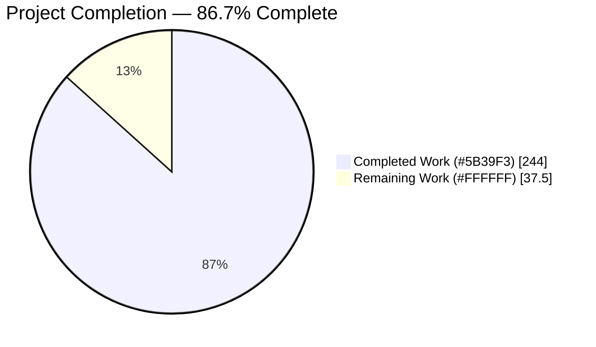
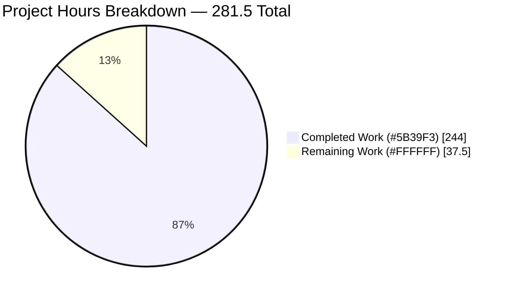
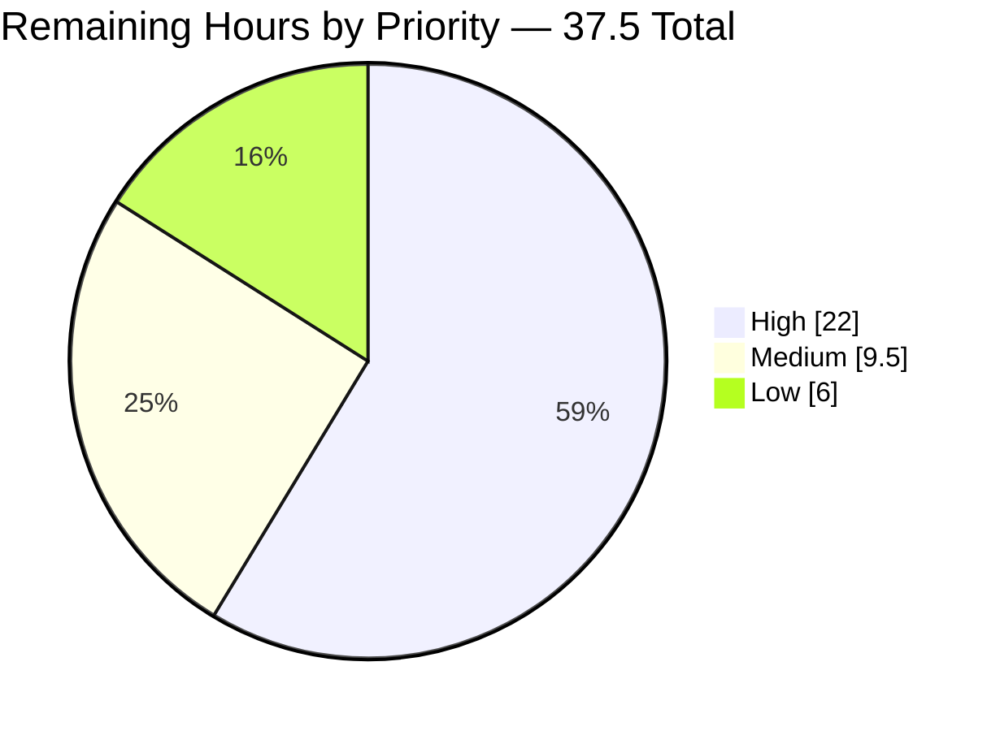

# 1. Executive Summary

## 1.1 Project Overview

This project delivers a machine-verifiable data-lineage and derivation-rule register for the mainframe indicator and Critical-Data-Element population of the CICS Bank Sample Application. Four new files under `docs/indicators/` record, for all 68 indicators and CDEs declared across the 37 COBOL copybooks, every code location that creates, writes, reads or consumes them; how each value is derived, quoted verbatim from source; and which of the 21 business features and 38 REST endpoints touch them. It serves data governance, migration planning and impact analysis, turning knowledge held only in COBOL, Java and z/OS Connect artifacts into a queryable, citation-backed asset.

## 1.2 Completion Status



| Metric | Value |
|---|---|
| Total Hours | 281.5 |
| Completed Hours (AI + Manual) | 244.0 (AI 244.0 · Manual 0.0) |
| Remaining Hours | 37.5 |
| Percent Complete | 86.7% |

Scope is the planned deliverable set plus the path-to-production work needed to put the register into service: 244.0 / (244.0 + 37.5) = 86.7%. All 30 in-plan requirements are delivered; the remaining 37.5 hours are sign-off, governance handover and automation.

## 1.3 Key Accomplishments

- 68 of 68 indicators and CDEs documented across 2,308 lineage rows citing 134 source files.
- All 37 copybooks accounted for in a ledger summing to 68 slugs; all 29 COBOL programs represented.
- 1,022 derivation trees, every chain ending at a named input field or literal.
- 6,010 verbatim quotations and 6,346 line-anchored citations, all verified against source.
- A 60 × 69 RFC 4180 matrix over 21 features and 38 endpoints, with a cell-identical readable twin.
- Repository defects, representation drifts and the channel-discriminator gap recorded as found.
- Four additions and nothing else: no source, API, configuration or existing documentation changed.

## 1.4 Critical Unresolved Issues

| Issue | Impact | Owner | ETA |
|---|---|---|---|
| Natural-language characterisations in section headers, `Determination` cells and `Rule` statements are not machine-checkable; citations and quotations are verified, the interpretations built on them are not | Medium — a mischaracterised field would read as authoritative; a sampled sign-off read is needed before this becomes the register of record | Data Governance + Mainframe SME | 1 day |
| No automated gate protects the register against citation drift; the acceptance checks pass but are not wired into the repository (see 5.2) | Medium — a later edit to any of the 114 cited source files can invalidate line-anchored citations silently | Platform / DevOps | 1 day |
| Source-level defects and configuration exposures the register surfaces are recorded but not triaged: `double`/`float`/`int` money against `BigDecimal`, `DELACCZ.cpy` bound to the wrong layout, five contracts requiring bodies their client omits, fail-code paths that render failure as success, and a client-supplied channel discriminator | High for the application, none for the register — each is documented with citations, and closing them is source work outside this scope | Application Owner + Security | 1 week |

## 1.5 Access Issues

No access issues identified. Every claim is verifiable from the repository with the local toolchain — `python3` 3.13.7 (standard library only), `git` 2.51.0 and `pre-commit` 4.6.2 — all exercised. No credentials, endpoints or third-party accounts are needed, and nothing in scope compiles, so the absent Java and Maven toolchain blocks nothing.

## 1.6 Recommended Next Steps

1. **[High]** Sign-off read of the 13 minimum-set indicators plus one section per group (8.0h).
2. **[High]** Triage the recorded source defects and configuration exposures (8.0h).
3. **[High]** Commit the acceptance checks and gate them in CI against drift (6.0h).
4. **[Medium]** Assign owner and steward per indicator group; set a refresh cadence (6.0h).
5. **[Medium]** Add an index entry and confirm the tables render at full scale (3.5h).

# 2. Project Hours Breakdown

## 2.1 Completed Work Detail

| Component | Hours | Description |
|---|---|---|
| Source census and lineage extraction | 32.0 | Full `COPY` / `EXEC SQL INCLUDE` census across 29 programs, field and `88`-level census across 37 copybooks, SECTION-and-paragraph taxonomy per program, Java commarea and persistence tiers, 10 Swagger contracts and their service bindings |
| Directive 1 lineage inventory | 52.0 | 68 indicator sections in canonical registry order, 2,308 rows in the mandated four-column shape, ordered create → write → read → consume, each row citing a repository path and locator |
| Endpoint-to-backend chain model | 14.0 | 38 endpoints resolved through their complete request-handling chains — `executableName` bindings for the ten z/OS Connect services, handler-to-accessor tracing for the 28 JAX-RS operations |
| Coverage ledger, negative determinations and defect records | 12.0 | 37-row ledger summing to 68 slugs, 42 explicit "(none in repository)" resolutions, and the recorded repository defects, representation drifts and DB2 declaration-versus-DDL reconciliation |
| Directive 2 derivation catalogue | 54.0 | 1,022 derivation trees over 4,738 nodes, one root per distinct path, verbatim conditions with line-range citations, every leaf terminal-classified, fail-code semantics scoped per program |
| Directive 3 machine-queryable matrix | 16.0 | Projection model with `C > W > R > X` collapse, plus the 60-column × 69-row RFC 4180 grid |
| Directive 3 Markdown twin and legend | 6.0 | Column-identical mirror of the CSV with a 12-row legend publishing the cell domain, precedence and inclusion rules |
| Acceptance harness | 18.0 | The six published validators plus eight extended structural checks, each proven by mutating a copy of the register and confirming the intended check fails |
| Verification passes | 30.0 | 6,010 quotations and 6,346 citations re-read against source, cell-by-cell matrix audits, ledger and program-coverage reconciliation, hygiene and boundary proofs |
| Format, hygiene and boundary conformance | 10.0 | Prose-suppression discipline, CRLF byte-exact editing, zero trailing whitespace and single terminating newline, four-file scope enforcement |
| **Total** | **244.0** | |

## 2.2 Remaining Work Detail

| Category | Hours | Priority |
|---|---|---|
| Content sign-off — sampled human read of section headers, `Determination` cells and `Rule` statements against their cited source | 8.0 | High |
| Defect and exposure triage — assign owner and disposition to each recorded source defect and configuration exposure | 8.0 | High |
| Persist the acceptance checks in the repository and gate them in CI against citation drift | 6.0 | High |
| CDE governance handover — owner and steward per indicator group, refresh cadence, register-of-record decision | 6.0 | Medium |
| Downstream consumer wiring — load `usage-matrix.csv` into the impact-analysis tooling and agree the endpoint-column inclusion rule with its consumers | 4.0 | Low |
| Rendered-output verification of the three Markdown files at full scale on the hosting platform | 2.0 | Medium |
| Specification reconciliation — carry the source-verified denominators (46 condition names, 37 copybooks, overdraft-limit characterisation) back into the governing plan | 2.0 | Low |
| Discoverability — add one index entry so the register is reachable from existing documentation | 1.5 | Medium |
| **Total** | **37.5** | |

## 2.3 Hours Reconciliation

| Check | Result |
|---|---|
| Section 2.1 total | 244.0 |
| Section 2.2 total | 37.5 |
| 2.1 + 2.2 = Total Project Hours (Section 1.2) | 244.0 + 37.5 = 281.5 ✓ |
| Completion formula | 244.0 / 281.5 = 86.7% ✓ |
| Remaining hours consistent across Sections 1.2, 2.2 and 7 | 37.5 in all three ✓ |

# 3. Test Results

This project has no compiled artifact and no unit-test framework: the deliverables are three Markdown files and one CSV, and the repository contains no documentation generator, build or test runner. Its acceptance contract is instead a set of executable structural validators, run from the repository root with `python3` 3.13.7 and standard shell tooling. Every result below was observed by executing the check against the current working tree.

| Area / Category | Framework | Tests | Passed | Failed | Coverage | What This Proves |
|---|---|---|---|---|---|---|
| Cross-file registry and ordering | Python `csv` + `re` | 1 | 1 | 0 | 68 of 68 slugs in all four files | One canonical slug sequence joins the four files as ordered lists, so the register is diffable and joinable end to end |
| Directive 1 lineage inventory structure | Python structural parser | 5 | 5 | 0 | 69 sections, 2,308 rows, 37-row ledger, 29 of 29 programs | Every indicator has exactly one four-column table, only the four legal operations appear, rows read create → write → read → consume, and no copybook or program is unaccounted for |
| Directive 2 derivation trees | Shell + Python tree walk | 3 | 3 | 0 | 1,378 of 1,378 leaves, 46 of 46 condition names | Every derivation chain terminates at a named input field or literal, the four-level shape holds exactly, and no `88`-level condition name in source is missing a rule |
| Directive 3 machine-queryable matrix | Python `csv` strict parse | 5 | 5 | 0 | 60 × 69 grid, 4,012 cells, 21 features, 38 endpoints | The matrix is valid RFC 4180 with a closed `{C,W,R,X,""}` domain, every feature and endpoint column is present and populated, and no row or column is empty |
| Directive 3 Markdown twin | Python cell comparison | 3 | 3 | 0 | 4,012 of 4,012 cells identical | The human-readable table is a faithful mirror of the machine-queryable file — same header, same order, no column dropped |
| Source-evidence fidelity | Python quote and citation verifier | 3 | 3 | 0 | 6,010 quotations · 6,346 citations · 114 files | Every quoted fragment is recoverable from its cited line range and every locator resolves in-bounds, so any claim can be re-checked at source |
| Format, hygiene and boundary conformance | Shell line-form scan, `pre-commit` v3.2.0, `git` range diff | 18 | 18 | 0 | 4 of 4 files, whole repository | Content stays inside headers, table rows and rule nodes; files are pure CRLF UTF-8 with no trailing whitespace and a single terminating newline that the repository hooks accept unchanged; and the branch adds exactly the four register files, touching no COBOL, Java, API artifact, configuration or existing documentation |
| **Total** | | **38** | **38** | **0** | | |

### Not Covered

Four things this register delivers are not exercised by any of the checks above, and a human should close them before it is treated as authoritative:

- **Natural-language characterisations.** Section headers, `Determination` cells and `Rule` statements are the one class of content no validator can judge. The checks prove every citation resolves and every quotation is exact; whether a label such as "carried and persisted but not used by any balance or overdraft computation" fairly describes the field was established by reading source. Re-read a sample against the cited lines.
- **Rendered output.** No renderer was exercised. GFM conformance is verified structurally — escaped pipes, uniform cell counts, ATX headings, four-level list nesting — but the 68 four-column tables and the 60-column matrix have not been viewed as rendered pages.
- **Downstream consumption.** Nothing in the repository reads `usage-matrix.csv`. Its contract is proven against RFC 4180 and against the inventory it joins to, but no tool has yet queried it.
- **The endpoint-column inclusion rule.** The rule that an endpoint column carries a token when any artifact in that endpoint's complete request-handling chain touches the indicator is published in the matrix legend and applied uniformly, but it is an interpretation. A consumer applying a narrower reading of "documented endpoint" would expect different cell counts and should agree the rule first.

# 4. Runtime Validation & UI Verification

The deliverables are static text. They have no service, no endpoint, no user interface and no executable path, and the repository has no documentation build, preview server or deploy step — no listening port exists to exercise. Runtime validation therefore takes the form of executing the acceptance checks against the delivered files and querying them the way a consumer will, which is what the statuses below record.

- ✅ **Acceptance checks execute clean from the repository root** — all six validators run under `python3` 3.13.7 with the standard library only, no installation and no configuration.
- ✅ **Cross-file join exercised** — the slug sequence extracted independently from all four files matches as an ordered list, 68 in each.
- ✅ **Matrix queried as a consumer would** — `csv.DictReader` over `usage-matrix.csv` answers real questions: feature F-015 touches 17 indicators; `account-available-balance` carries a write token in exactly six columns, two features and four payment or transfer endpoints.
- ✅ **Register queried by indicator** — extracting a single section by slug returns its header with PIC clause and defining citation, the mandated column header, then its lineage rows in create → write → read → consume order.
- ✅ **Derivation lookup exercised** — extracting `customer-credit-score` from the rule catalogue returns its roots, the seeded and unseeded pseudo-random steps, and terminal leaves naming the literal bounds and the task-number input.
- ✅ **Coverage ledger queried** — a single grep returns any copybook's determination, including the zero-indicator cases, which carry an explicit statement rather than a blank.
- ✅ **Repository hygiene hooks run for real** — `pre-commit` v3.2.0 executes `trailing-whitespace` and `end-of-file-fixer` over all four files, passes, and rewrites nothing.
- ✅ **Boundary verified against the whole repository** — the branch's cumulative diff is four additions and no other changed path; the working tree is clean.
- ⚠ **Rendered appearance not observed** — no renderer, preview or hosting surface was exercised; structure is verified textually only.
- ⚠ **No downstream tool has consumed the CSV** — the file is a new governance asset with no reader in this repository yet.

# 5. Compliance & Quality Review

## 5.1 Compliance Matrix

Each row states where the deliverable stands now, measured against the working tree.

| # | Requirement | Status | Verified State |
|---|---|---|---|
| 1 | Exactly four new files under `docs/indicators/`, nothing else created or modified | ✅ Pass | Branch diff is four additions; `docs/` holds only those four files — no index, asset or placeholder |
| 2 | 68 indicator sections in canonical registry order, with the 13-item minimum set first | ✅ Pass | 68 sections; groups 13 + 6 + 4 + 11 + 24 + 1 + 5 + 4; minimum set at positions 1–13 in the specified order |
| 3 | One table per section with exactly the four mandated columns | ✅ Pass | 68 of 68 headers byte-exact; 2,308 rows at four fields; no fifth column anywhere |
| 4 | Operation vocabulary and create → write → read → consume row order | ✅ Pass | Tokens exactly create 225, write 915, read 447, consume 721; zero ordering violations |
| 5 | Zero unresolved origin or consumer references | ✅ Pass | 42 explicit "(none in repository)" determinations; the 8 unreferenced copybooks and both absent allocator producers resolved with the search method stated |
| 6 | Copybook coverage ledger over the whole copybook population | ✅ Pass | 37 rows set-equal to the copybooks on disk; slug counts sum to 68; all 29 programs cited somewhere in the register |
| 7 | Physical-level traceability for every asserted fact | ✅ Pass | 6,346 locators across 114 files resolve in-bounds; five fixed locator forms only — 1,111 SECTION/paragraph, 1,109 line, 73 endpoint, 6 heading, 9 negative |
| 8 | Derivation catalogue in the same order, four-level shape, one root per distinct path | ✅ Pass | 68 sections ordered identically; indent histogram exactly {1022, 1022, 1316, 1378}; the channel discriminator carries its two mandated roots |
| 9 | Verbatim conditions; every chain terminating at an input field or literal | ✅ Pass | 6,010 quotations verified against their cited ranges; 1,378 of 1,378 leaves terminal-classified; zero unknown derivations |
| 10 | Matrix covers all 21 features and all documented endpoints, joinable to the inventory | ✅ Pass | 60 × 69 grid, 4,012 cells, 745 populated; endpoint columns set-equal to the Swagger-derived ten and the annotation-derived 28; no empty row or column |
| 11 | Prose suppression, hygiene gates and dependency freeze | ✅ Pass | Zero lines outside headers, table rows and list nodes; pure CRLF UTF-8, no trailing whitespace, single terminating newline; no manifest or configuration touched |
| 12 | Defects recorded as found, never normalised | ✅ Pass | The layout mismatch, monetary-precision, URL-typo, contract-break, fail-code-handling and channel-discriminator records are all carried with citations on both sides |

## 5.2 AAP & Rule Divergences and Gaps

No user-specified rules exist for this project — the rules document returns none — so no rule was breached, and every divergence below is a departure from the governing plan rather than from a rule. None blocks release; two require human work and appear in Section 2.2.

| What the AAP/Rule Required | What Was Delivered Instead | Why It Diverged | Impact | Remediation |
|---|---|---|---|---|
| 47 `88`-level condition names traced to a rule | 46, with the discrepancy recorded in the register | Direct source census yields 46; inventing a 47th would be fabrication | None — coverage is 46 of 46, i.e. 100% of the real population | Correct the figure in the plan (in Section 2.2) |
| 38 COBOL copybooks | 37, with the plan's figure recorded as a documentation error | Filesystem enumeration yields 37, and the plan's own glossary also states 37 | None — the ledger is complete against the real population | Correct the figure in the plan |
| The overdraft limit "governs available-versus-actual divergence" | Characterised as carried and persisted but used by no balance or overdraft computation | No source supports the governing claim; the real overdraft gate is the available-balance computation in the payment program | None — the register is source-true where the plan was not | Confirm the reading; no deliverable change needed |
| The wire-naming shim described as "stripping the three-character `comm` prefix" | Described as returning `input.substring(3)` — the first three characters of any supplied name — with explicit `@JsonProperty` values governing where present | The instruction is factually wrong: `comm` is four characters and the method is length-blind | Positive — wire-name citations elsewhere are now interpretable | Correct the wording in the plan if revised |
| The published quote-fidelity validator as the verbatim-evidence gate | That validator run exactly as published, plus a literal-aware comparator and a citation existence-and-range check | The published pattern cannot reach quoted spans whose locator sits in a table's fourth column, and it normalises whitespace inside fixed-width COBOL literals | Positive — the gate is strictly stronger; 6,346 locators are now covered for existence and range | Adopt the stronger variants if the checks are automated |
| The six published validators as the complete acceptance set | Those six plus eight extended structural checks, none of them stored in the repository | The six cannot see an extra section, a malformed locator, an uncited node, a comment quoted as a condition or a missing required cell; the four-file boundary forbids adding a fifth path to hold them | Medium — nothing re-runs the checks automatically, so citation drift would go unnoticed | Sanction a path for the checks and gate them in CI (in Section 2.2) |
| Allocator flags to show write and read participation in the identity-allocation and create features; one reference-data slug to be "mostly empty" | Cells follow the plan's own `C > W > R > X` precedence and the evidenced lineage; participation is recorded as inventory rows | A cell holds one token and create outranks write and read, so a create row necessarily masks them; the reference-data slug has real evidenced lineage once its producers are documented | None — no operation is lost, only relocated to where it is visible | None |
| Discoverability of the new register | No repository file links to `docs/indicators/`; it is reachable by path only | The boundary forbids modifying any pre-existing documentation file, including adding a link | Medium — a reader who does not know the path may never find it | Add one index entry (in Section 2.2) |

**The condition-name denominator.** The plan sets the coverage target at 47 `88`-level condition names across the copybooks. A comment-aware census of all 37 copybooks yields 46: `PROCTRAN.cpy` 27, `PROCISRT.cpy` 7, `NEWACCNO.cpy` and `NEWCUSNO.cpy` 3 each, `ACCTCTRL.cpy` and `CUSTCTRL.cpy` 2 each, `ACCOUNT.cpy` and `CUSTOMER.cpy` 1 each. All 46 appear as `Resulting Value` nodes in `docs/indicators/rule-hierarchy.md`, so coverage is 100% of what source actually declares. The register states the discrepancy rather than padding to the target, which is the correct treatment: a fabricated 47th name would have been undetectable to a reader and corrosive to every other count. The only action is to correct the figure in the governing plan.

**The copybook denominator.** The plan carries two different copybook counts, 38 in one place and 37 in another. Enumeration of `src/base/cobol_copy/` yields 37 `.cpy` files and nothing else, and the coverage ledger has exactly 37 rows that are set-equal to that enumeration. The register records the 38 as a documentation error. The practical consequence is nil — a reader auditing completeness against the ledger will find every copybook on disk represented — but anyone diffing plan against artifact will see the difference and should resolve it in the plan.

**The overdraft-limit characterisation.** The plan describes the account overdraft limit as governing the divergence between available and actual balance. Reading the source does not support that: the field is seeded, carried and persisted, and no balance or overdraft computation consumes it. The real overdraft gate is the available-balance arithmetic in the payment program, which the register documents in full with its verbatim predicate and fail code. The register therefore labels the field for what it is. A reader planning a migration needs this distinction, because migrating the limit as a behavioural control would carry over a behaviour the system does not have.

**The wire-naming shim.** The plan instructs describing the JSON naming strategy as stripping a three-character `comm` prefix. Two things are wrong with that: `comm` is four characters, and the method returns the input minus its first three characters regardless of what those characters are. The register states the mechanism and cites the method and its return, and adds the fact that governs in practice — where a DTO declares an explicit wire property, that declared value wins and the strategy is irrelevant. This matters because wire-field citations throughout the register depend on the reader understanding how a Java field name becomes a JSON property.

**Strengthening the verbatim-evidence gate.** The plan publishes a quote-fidelity validator whose pattern binds a quoted span to a following citation. Two blind spots emerged in use: it cannot reach spans whose locator sits in a table's fourth column, and because it normalises all whitespace it cannot detect altered padding inside fixed-width COBOL literals. Both were closed by running the published validator unchanged and adding a literal-aware comparator plus a check that every locator resolves to a real file and an in-range span. Present state: 6,010 quotations verified with zero failures and 6,346 locators across 114 files resolving in-bounds. If the checks are ever automated, use the stronger variants.

**The acceptance set is not self-sufficient, and is not persisted.** The six published validators measure slug identity, matrix shape, prose suppression, terminal markers, hygiene and quote fidelity. None can see an extra top-level section, a locator that mixes narrative into a machine-joinable column, an uncited rule node, a source comment presented as an executable condition, or a required cell left empty. Eight further checks cover exactly those cases, each proven by mutating a copy of the register and confirming the intended check fails. They are not in the repository, because the boundary permits only the four register files. Until a path is sanctioned for them and a CI job runs them, nothing detects citation drift when a cited source file changes.

**Matrix cell expectations.** A schema note in the plan expected the two allocator function flags to show write and read participation in the identity-allocation and create-customer/create-account features, and expected one reference-data slug to be largely empty. Delivered cells follow the plan's own precedence rule instead: a cell holds one token, create outranks write and read, and every one of those feature columns already carries a create token from the owning copybook declaration. The write and read participation is recorded where it is visible and checkable — as rows inside the indicator's own section. The reference-data slug carries nine feature tokens because its real producers and consumers were documented; the expectation of emptiness predated that lineage.

**Discoverability.** Nothing in the repository points at `docs/indicators/`. The boundary makes every pre-existing documentation file read-only, so no index entry, README line or navigation link could be added, and the plan records this as an accepted consequence rather than an oversight. It is nonetheless a real risk to adoption: a governance asset nobody can find is not in service. One line in an existing guide closes it, and that is the cheapest item in the remaining work.

# 6. Risk Assessment

These are forward-looking risks to the register's usefulness and to the application it documents. The security and integration entries are exposures the register surfaces with citations; closing them is source work that this documentation scope deliberately excludes.

| Risk | Category | Severity | Probability | Mitigation | Status |
|---|---|---|---|---|---|
| Citation drift as source evolves — 6,346 locators are pinned to exact lines in 114 files, so any edit to a cited COBOL, Java or contract file can silently invalidate a locator | Technical | High | Medium | Re-run the quote-fidelity and citation-range checks whenever a cited path changes; both are single commands and complete in seconds | Open — checks proven, not yet automated |
| No automated regression gate — the acceptance checks are not stored in the repository, so nothing re-runs them | Operational | Medium | High | Commit the checks under a sanctioned path and add a CI job triggered by changes to the register or to any cited source file | Open (6.0h in Section 2.2) |
| Natural-language characterisations rest on human reading — citations and quotations are machine-verified, the interpretations built on them are not | Technical | Medium | Medium | Sampled sign-off read across the registry groups before the register becomes the register of record | Open (8.0h in Section 2.2) |
| Recorded source defects remain unfixed — monetary values held as `double`, `float` and `int` against a correct `BigDecimal` declaration; a delete-account service bound to a list-accounts layout; five contracts declaring required bodies their only client omits; fail-code paths that render failure as success | Technical | High | High | Triage each with an owner and disposition; the register cites both sides of every one | Open by design — source is read-only in this scope |
| Channel discriminator is client-supplied — the payment channel value originates in a client-side field initialiser while the payment program gates both the product restriction and the overdraft check on it, so another value bypasses both | Security | Critical | Medium | Derive the channel server-side from authenticated request context and reject client-supplied overrides | Open — documented as a governance gap |
| Supplied service configuration is unauthenticated and non-TLS, with wildcard cross-origin settings, and the web deployment descriptor declares no security constraint and disables cross-site request forgery protection | Security | Critical | Medium | Require authentication and HTTPS, restrict origins and methods, add declarative constraints before any deployment | Open |
| Endpoint-column semantics are an interpretation — the complete-chain inclusion rule is published and applied uniformly, but a narrower reading of "documented endpoint" produces different cell counts | Integration | Low | Medium | Agree the rule with matrix consumers before automated impact queries; the legend states it in full | Mitigated — rule published |
| No inbound discoverability — nothing in the repository links to the register, so it is reachable by path only and may simply be missed | Operational | Medium | High | Add one index entry from an existing guide | Open (1.5h in Section 2.2) |

# 7. Visual Project Status

Completed work is shown in Blitzy dark blue (#5B39F3); remaining work in white (#FFFFFF).



Remaining effort by priority, from Section 2.2:



| Dimension | Completed | Remaining | Total |
|---|---|---|---|
| Engineering hours | 244.0 | 37.5 | 281.5 |
| In-plan requirements | 30 | 0 | 30 |
| Path-to-production activities | 1 | 7 | 8 |
| Acceptance checks passing | 38 | 0 | 38 |

| Coverage Dimension | Delivered | Population | Percentage |
|---|---|---|---|
| Indicators and CDEs documented | 68 | 68 | 100% |
| Minimum-set indicators sectioned | 13 | 13 | 100% |
| Copybooks in the coverage ledger | 37 | 37 | 100% |
| COBOL programs appearing as producer or consumer | 29 | 29 | 100% |
| `88`-level condition names traced to a rule | 46 | 46 | 100% |
| Feature columns | 21 | 21 | 100% |
| Endpoint columns | 38 | 38 | 100% |
| Derivation chains terminating at an input field or literal | 1,378 | 1,378 | 100% |

# 8. Summary & Recommendations

**What was delivered.** Four new files under `docs/indicators/` — 7,717 lines across roughly 1.4 MB — turn the field-level knowledge embedded in 37 COBOL copybooks, 29 COBOL programs, 82 Java sources and 10 z/OS Connect contracts into a queryable register. `inventory.md` gives each of the 68 indicators and CDEs its own section and a four-column lineage table, 2,308 rows in all, and closes with a ledger accounting for every copybook on disk. `rule-hierarchy.md` mirrors that order and explains how each value comes to be, in 1,022 derivation trees whose conditions are quoted verbatim from source and whose 1,378 leaves each terminate at a named input field or literal. `usage-matrix.csv` and `usage-matrix.md` project the same registry across the 21 business features and 38 endpoints as a 60-column grid, machine-queryable and human-readable from a single source of truth. The whole branch touches nothing else: four additions, zero modifications to COBOL, Java, API artifacts, configuration or pre-existing documentation.

**What was verified.** The register's acceptance contract is a set of executable structural checks rather than a test suite, because nothing here compiles. Thirty-eight checks were run against the delivered files and all thirty-eight pass: one canonical slug sequence joins the four files as ordered lists; every lineage table holds exactly the mandated four columns with only the four legal operations in create → write → read → consume order; every derivation chain terminates and none is marked unknown; the matrix parses as strict RFC 4180 with a closed cell domain, all 21 feature and 38 endpoint columns present and populated, and its Markdown twin identical across all 4,012 cells; 6,010 quotations reproduce byte-faithfully from their cited line ranges and 6,346 locators across 114 files resolve in-bounds; content stays inside headers, table rows and rule nodes; the files are pure CRLF UTF-8 that the repository's own hygiene hooks accept without rewriting; and the branch boundary holds against the whole repository.

**What remains.** 37.5 hours, none of it in-plan deliverable work. The register is 86.7% of the way to being in service: content is complete and mechanically proven, and what is left is the handover a governance asset needs. Three items are high priority. A sampled human read must confirm that the natural-language characterisations sitting on top of verified citations are fair — the one class of content no check can judge. The acceptance checks must be committed and gated in CI, because 6,346 line-anchored citations are exactly as durable as the process that re-verifies them, and today nothing does. And the source-level defects the register surfaces — monetary values held as `double` and `float`, a delete-account service bound to a list-accounts layout, five contracts requiring bodies their only client omits, fail paths that render as success, and a client-supplied channel discriminator that bypasses both the product restriction and the overdraft check — need an owner and a disposition each. They are documented with citations on both sides; they are not fixed, and fixing them was explicitly outside this scope.

**Critical path to production.** Sign-off read, then CI gating, then governance handover: owner and steward per indicator group, a refresh cadence, and a decision on whether this becomes the register of record. Discoverability and rendered-output confirmation are small and can run in parallel; downstream consumer wiring and reconciling the plan's stale denominators can follow. Success is measurable without ambiguity — the checks stay at thirty-eight of thirty-eight, coverage stays at 100% of every population the register claims to cover, and a change to a cited source file fails the build rather than quietly ageing the citation.

**Production readiness.** The documentation is ready to hand over. Its numbers are reproducible from the working tree, its claims are individually re-checkable at source, and its known gaps are stated rather than implied. Two cautions belong on the handover note. First, this register documents the system as it is, including its defects; do not read a documented behaviour as an endorsed one. Second, the security exposures it surfaces — an unauthenticated, non-TLS service configuration with wildcard cross-origin settings, a deployment descriptor with no security constraint and request-forgery protection disabled, and a bypassable channel discriminator — are properties of the sample application, not of the register, and they must be addressed before any deployment that this register is used to plan.

# 9. Development Guide

Every command below was executed from the repository root against the current working tree, and the outputs shown are the ones observed.

## 9.1 System Prerequisites

| Requirement | Version verified | Why it is needed |
|---|---|---|
| `python3` | 3.13.7 | Runs every acceptance check and every matrix query — standard library only (`csv`, `re`, `os`, `glob`), no packages to install |
| `git` | 2.51.0 | Boundary verification and history inspection |
| `pre-commit` | 4.6.2 (hooks pinned at v3.2.0) | Runs the repository's own `trailing-whitespace` and `end-of-file-fixer` hygiene hooks |
| Shell tooling | `grep`, `awk`, `sed`, `tr`, `od`, `tail` | Line-form and byte-level checks |

Nothing else is required. There is no documentation generator, no build and no test runner in this repository, and no COBOL compiler is needed because the register is produced by reading source rather than executing it. `java` and `mvn` are absent from this environment and nothing in the register's scope compiles, so their absence blocks nothing.

## 9.2 Environment Setup

```bash
# 1. Clone and switch to the branch carrying the register
git clone <repository-url> cics-banking-sample-application-cbsa
cd cics-banking-sample-application-cbsa
git checkout blitzy-f26c4f2d-ecee-4146-8adf-630ef9c45d76

# 2. Confirm the four register files are present and nothing else was added
find docs -type f | sort
# docs/indicators/inventory.md
# docs/indicators/rule-hierarchy.md
# docs/indicators/usage-matrix.csv
# docs/indicators/usage-matrix.md

# 3. Confirm the toolchain
python3 --version   # Python 3.13.7
git --version       # git version 2.51.0
```

**The one environment rule that matters.** `.gitattributes` sets `* text eol=crlf` repository-wide, so all four register files — and the COBOL and Java sources they cite — are CRLF in the working tree. Any pattern anchored to end-of-line silently returns nothing unless carriage returns are stripped first:

```bash
# Anchored search WITHOUT stripping CR — returns 0 and looks like an absent construct
grep -c 'literal)$' docs/indicators/rule-hierarchy.md
# 0

# Same search WITH CR stripped — the real count
tr -d '\r' < docs/indicators/rule-hierarchy.md | grep -c 'literal)$'
# 688
```

The same applies in Python: open a register file with `newline=''` before rewriting it, or the round trip discards every carriage return and breaks both the repository's end-of-line rule and the hygiene check.

## 9.3 Running the Acceptance Checks

Run all six from the repository root. Each exits 0 on success.

```bash
# V1 — one canonical slug sequence across all four files, as ORDERED lists
python3 - <<'PYEOF'
import csv, re, sys
D = "docs/indicators"
def md_headers(p):
    return [m.group(1) for m in
            (re.match(r'^## ([a-z0-9-]+)\s*(?:—.*)?$', l.rstrip('\r\n')) for l in open(p, encoding='utf-8'))
            if m]
inv = md_headers(f"{D}/inventory.md")
rul = md_headers(f"{D}/rule-hierarchy.md")
with open(f"{D}/usage-matrix.csv", newline='', encoding='utf-8') as f:
    csv_rows = list(csv.reader(f))
csv_slugs = [r[0] for r in csv_rows[1:] if r and r[0]]
md_slugs = []
for l in open(f"{D}/usage-matrix.md", encoding='utf-8'):
    l = l.rstrip('\r\n')
    if l.startswith('|') and not set(l) <= set('|- :'):
        c = l.strip('|').split('|')[0].strip()
        if re.fullmatch(r'[a-z0-9-]+', c):
            md_slugs.append(c)
ok = inv == rul == csv_slugs == md_slugs
print(f"inventory={len(inv)} rules={len(rul)} csv={len(csv_slugs)} md={len(md_slugs)}")
print("IDENTICAL SETS AND ORDER:", ok)
sys.exit(0 if ok else 1)
PYEOF
# inventory=68 rules=68 csv=68 md=68
# IDENTICAL SETS AND ORDER: True
```

```bash
# V2 — RFC 4180 conformance, uniform field count, closed cell domain
python3 - <<'PYEOF'
import csv, sys
P = "docs/indicators/usage-matrix.csv"
raw = open(P, 'rb').read()
with open(P, newline='', encoding='utf-8') as f:
    rows = list(csv.reader(f))
hdr = rows[0]
ragged = [i+1 for i, r in enumerate(rows) if len(r) != len(hdr)]
crlf = raw.count(b'\r\n')
legal = {'C', 'W', 'R', 'X', ''}
bad = [(i+2, j+2, v) for i, r in enumerate(rows[1:]) for j, v in enumerate(r[1:]) if v not in legal]
print(f"columns={len(hdr)} rows={len(rows)} ragged={ragged or 'none'}")
print(f"CRLF terminated: {crlf == len(rows)}  header[0]={hdr[0]!r}  illegal cells={bad or 'none'}")
sys.exit(0 if not ragged and crlf == len(rows) and hdr[0] == 'indicator_slug' and not bad else 1)
PYEOF
# columns=60 rows=69 ragged=none
# CRLF terminated: True  header[0]='indicator_slug'  illegal cells=none
```

```bash
# V3 — content confined to headers, table rows and rule nodes
for f in docs/indicators/inventory.md docs/indicators/rule-hierarchy.md docs/indicators/usage-matrix.md; do
  n=$(tr -d '\r' < "$f" | grep -vE '^$|^#{1,6} |^\|' | grep -vcE '^ *- ' || true)
  echo "$f offending_lines=$n"
done
# docs/indicators/inventory.md offending_lines=0
# docs/indicators/rule-hierarchy.md offending_lines=0
# docs/indicators/usage-matrix.md offending_lines=0
```

```bash
# V4 — every derivation chain terminates at an input field or literal
f=docs/indicators/rule-hierarchy.md
leaves=$(tr -d '\r' < "$f" | grep -cE '^ *- Resulting Value:' || true)
marked=$(tr -d '\r' < "$f" | grep -cE '^ *- Resulting Value:.*\(terminal: (input field|literal)\)' || true)
unknown=$(tr -d '\r' < "$f" | grep -ci 'unknown derivation' || true)
echo "leaves=$leaves marked=$marked unmarked=$((leaves-marked)) unknown_derivation=$unknown"
# leaves=1378 marked=1378 unmarked=0 unknown_derivation=0
```

```bash
# V5 — byte hygiene: no trailing whitespace, single terminating CRLF
for f in docs/indicators/*; do
  tw=$(grep -cE '[ \t]+$' "$f" || true)
  echo "$f trailing_ws_lines=$tw last_bytes=$(tail -c 2 "$f" | od -An -c | tr -s ' ')"
done
# every file: trailing_ws_lines=0 last_bytes= \r \n
```

```bash
# V6 — every quoted fragment is recoverable from its cited line range
python3 - <<'PYEOF'
import re, os, sys
PAT = re.compile(r'`([^`]+)`[^`\[]*\[([^\]:]+):L(\d+)(?:-L(\d+))?\]')
def norm(s): return re.sub(r'\s+', ' ', s).strip()
total_fail = 0
for doc in ("docs/indicators/rule-hierarchy.md", "docs/indicators/inventory.md"):
    ok = fail = 0
    for line in open(doc, encoding='utf-8'):
        for q, path, a, b in PAT.findall(line):
            if not os.path.exists(path):
                print(f"FAIL missing file {path}"); fail += 1; continue
            src = open(path, encoding='utf-8', errors='replace').read().replace('\r\n', '\n').split('\n')
            lo, hi = int(a), int(b or a)
            if norm(q) in norm(' '.join(src[lo-1:hi])): ok += 1
            else:
                print(f"FAIL {path}:L{lo}-L{hi}"); fail += 1
    print(f"{doc}: quotes verified={ok} failed={fail}")
    total_fail += fail
sys.exit(0 if total_fail == 0 else 1)
PYEOF
# docs/indicators/rule-hierarchy.md: quotes verified=3738 failed=0
# docs/indicators/inventory.md: quotes verified=2272 failed=0
```

## 9.4 Hygiene and Boundary Verification

```bash
# The repository's own hygiene hooks, run for real
pre-commit run --files docs/indicators/inventory.md docs/indicators/rule-hierarchy.md \
                       docs/indicators/usage-matrix.csv docs/indicators/usage-matrix.md
# Trim Trailing Whitespace.................................................Passed
# Fix End of Files.........................................................Passed
# Check Yaml...........................................(no files to check)Skipped

# The branch must add exactly the four register files and change nothing else
git diff --name-status 46cbda5..HEAD
# A       docs/indicators/inventory.md
# A       docs/indicators/rule-hierarchy.md
# A       docs/indicators/usage-matrix.csv
# A       docs/indicators/usage-matrix.md

git diff --name-only 46cbda5..HEAD -- ':(exclude)docs/indicators/*' | wc -l   # 0
git status --porcelain | wc -l                                               # 0
```

## 9.5 Using the Register

```bash
# How many indicator sections are there? (68 indicators + the coverage ledger)
grep -c '^## ' docs/indicators/inventory.md
# 69

# Pull one indicator's complete lineage, header and all
awk '/^## account-actual-balance /{f=1} f&&/^## /&&!/account-actual-balance/{exit} f' \
    docs/indicators/inventory.md | tr -d '\r'
# ## account-actual-balance — ACCOUNT Actual Balance (`PIC S9(10)V99`) [src/base/cobol_copy/ACCOUNT.cpy:L35]
# | Program/API/Job | Operation (create\|write\|read\|consume) | File Path | Paragraph/Section Ref |
# ...

# Pull one indicator's derivation trees
awk '/^## customer-credit-score /{f=1} f&&/^## /&&!/customer-credit-score/{exit} f' \
    docs/indicators/rule-hierarchy.md | tr -d '\r'

# What determination did a copybook receive in the coverage ledger?
tr -d '\r' < docs/indicators/inventory.md | grep -E '^\| WAZI\.cpy'

# How much lineage does one program carry?
tr -d '\r' < docs/indicators/inventory.md | grep -c 'src/base/cobol_src/DBCRFUN.cbl'
# 69
```

```bash
# Which indicators does a business feature touch?
python3 - <<'PYEOF'
import csv
with open("docs/indicators/usage-matrix.csv", newline='', encoding='utf-8') as f:
    hits = [(r['indicator_slug'], r['F-015']) for r in csv.DictReader(f) if r['F-015']]
print(f"F-015 touches {len(hits)} indicators")
for slug, tok in hits[:6]: print(f"  {tok}  {slug}")
PYEOF
# F-015 touches 17 indicators
#   W  proctran-type-code
#   W  proctran-logical-delete-flag
#   W  dbcrfun-success-flag
#   W  dbcrfun-fail-code
#   W  account-available-balance
#   W  account-actual-balance
```

```bash
# Where is a critical data element written from?
python3 - <<'PYEOF'
import csv
with open("docs/indicators/usage-matrix.csv", newline='', encoding='utf-8') as f:
    rows = list(csv.DictReader(f))
row = next(r for r in rows if r['indicator_slug'] == 'account-available-balance')
w = [k for k, v in row.items() if v == 'W' and k != 'indicator_slug']
print(f"account-available-balance carries W in {len(w)} columns:")
for k in w: print("  ", k)
PYEOF
# account-available-balance carries W in 6 columns:
#    F-015
#    F-016
#    PUT /makepayment/dbcr
#    PUT /webui-1.0/banking/account/debit/{id}
#    PUT /webui-1.0/banking/account/credit/{id}
#    PUT /webui-1.0/banking/account/transfer/{id}
```

## 9.6 Troubleshooting

| Symptom | Cause | Resolution |
|---|---|---|
| A `grep` anchored with `$` returns 0 on a register or source file | The working tree is CRLF, so the carriage return sits before the anchor | Pipe through `tr -d '\r'` first; never read an empty result as an absent construct |
| A register file suddenly shows as modified across every line, and V5 reports the wrong terminating bytes | An editor or script rewrote the whole file with LF terminators | `git restore docs/indicators/<file>` and re-apply the change byte-exactly, reading with `newline=''` |
| V6 reports a failure after someone edits a COBOL or Java file | A cited line range moved; the register is well-formed but its locator is now stale | Re-point the citation to the statement's new range, and cite multi-line statements as ranges, not single lines |
| V2 reports `ragged` after a manual CSV edit | A row was hand-edited and lost or gained a field | Regenerate the row through a CSV writer with CRLF terminators rather than editing the line in place |
| `pre-commit` cannot fetch its hook repository | No network access | Use the equivalents directly: `grep -cE '[ \t]+$' <file>` for trailing whitespace and `tail -c 2 <file> \| od -An -c` for the terminator |
| `java` or `mvn` not found | Neither is installed, and neither is needed | Ignore — nothing in the register's scope compiles or builds |
| A boundary check reports a changed path outside `docs/indicators/` | Something edited source, configuration or pre-existing documentation | Revert it; the register's contract is four additions and no modifications |

# 10. Appendices

## A. Command Reference

| Purpose | Command |
|---|---|
| Registry and ordering check | The V1 `python3` heredoc in Section 9.3 |
| Matrix conformance check | The V2 `python3` heredoc in Section 9.3 |
| Prose-suppression check | `for f in docs/indicators/*.md; do tr -d '\r' < "$f" \| grep -vE '^$\|^#{1,6} \|^\|' \| grep -vcE '^ *- '; done` |
| Derivation-termination check | `tr -d '\r' < docs/indicators/rule-hierarchy.md \| grep -cE '^ *- Resulting Value:.*\(terminal: '` |
| Byte-hygiene check | `for f in docs/indicators/*; do grep -cE '[ \t]+$' "$f"; tail -c 2 "$f" \| od -An -c; done` |
| Quote-fidelity check | The V6 `python3` heredoc in Section 9.3 |
| Repository hygiene hooks | `pre-commit run --files docs/indicators/*` |
| Boundary proof | `git diff --name-status 46cbda5..HEAD` and `git diff --name-only 46cbda5..HEAD -- ':(exclude)docs/indicators/*'` |
| Count indicator sections | `grep -c '^## ' docs/indicators/inventory.md` |
| Extract one indicator's lineage | `awk '/^## <slug> /{f=1} f&&/^## /&&!/<slug>/{exit} f' docs/indicators/inventory.md \| tr -d '\r'` |
| Extract one indicator's derivation trees | `awk '/^## <slug> /{f=1} f&&/^## /&&!/<slug>/{exit} f' docs/indicators/rule-hierarchy.md \| tr -d '\r'` |
| Query the matrix by feature or endpoint | The `csv.DictReader` snippets in Section 9.5 |
| Coverage-ledger determination for a copybook | `tr -d '\r' < docs/indicators/inventory.md \| grep -E '^\\\| <NAME>\.cpy'` |

## B. Port Reference

No ports. The register has no runtime surface, no service and no listening socket; the repository contains no documentation build, preview server or deploy step for it. Ports referenced inside the register belong to the documented application, not to this deliverable, and are cited there to their own configuration artifacts.

## C. Key File Locations

| Path | Role |
|---|---|
| `docs/indicators/inventory.md` | 68 indicator/CDE sections with four-column lineage tables, closing with the copybook coverage ledger |
| `docs/indicators/rule-hierarchy.md` | 68 derivation-tree sections in identical order, verbatim conditions, terminal-classified leaves |
| `docs/indicators/usage-matrix.csv` | Machine-queryable 60 × 69 traceability grid, RFC 4180, CRLF |
| `docs/indicators/usage-matrix.md` | Legend plus a column-identical mirror of the CSV |
| `src/base/cobol_copy/` | 37 copybooks — the definitional origin of every indicator |
| `src/base/cobol_src/` | 29 COBOL programs — producers and consumers |
| `src/webui/src/main/java/com/ibm/cics/cip/bankliberty/` | Generated commarea classes, JAX-RS resources, DB2 and VSAM accessors |
| `src/Z-OS-Connect-Payment-Interface/`, `src/Z-OS-Connect-Customer-Services-Interface/` | Spring Boot wire DTOs and controllers |
| `src/zosconnect_artefacts/apis/`, `.../services/` | Ten Swagger contracts and the service interfaces and bindings they resolve to |
| `etc/install/base/db2jcl/` | Executable DDL — the authority for actual DB2 column types |
| `.gitattributes` | `* text eol=crlf`, which governs the working-tree form of every register file |
| `.pre-commit-config.yaml` | The repository's hygiene hooks, pinned at v3.2.0 |

## D. Technology Versions

| Component | Version | Notes |
|---|---|---|
| Python | 3.13.7 | Standard library only; no packages installed for this work |
| Git | 2.51.0 | |
| Git LFS | 3.7.1 | Present; the active pre-push hook is LFS only |
| pre-commit | 4.6.2 | Hook repository pinned at v3.2.0 (`trailing-whitespace`, `end-of-file-fixer`, `check-yaml`) |
| Node.js / npm | v22.23.2 / 11.18.0 | Present but not used by the register |
| Java / Maven | Not installed | Not required — nothing in the register's scope compiles or builds |
| Documentation generator | None | No MkDocs, Docusaurus, Sphinx, Antora, TypeDoc or JSDoc configuration exists anywhere in the repository |

## E. Environment Variable Reference

| Variable | Required | Purpose |
|---|---|---|
| — | None | The register and its checks require no environment variable, secret or credential |

Every check resolves paths relative to the repository root, reads repository files only, and makes no network call. Run them from the repository root and nothing needs configuring.

## F. Developer Tools Guide

- **Matrix queries** — use Python's standard `csv.DictReader`; the header row gives you feature IDs and endpoint labels as keys directly, so an impact query is one comprehension.
- **Section extraction** — `awk` with a slug-anchored start and a next-`##` stop is the reliable way to lift one indicator out of a 2,681-line or 4,876-line file.
- **Always strip carriage returns** before any line-anchored pattern, in both the register and the sources it cites.
- **Never hand-edit the CSV** — regenerate the affected row through a CSV writer with CRLF terminators so the field count and the twin stay in step.
- **Keep the twin in step** — treat `usage-matrix.csv` as the single source of truth and regenerate `usage-matrix.md` from it; the cell-identity check will catch any drift.
- **Boundary proof** — `git diff --name-status 46cbda5..HEAD` is the whole contract in one command.

## G. Glossary

| Term | Meaning |
|---|---|
| CDE | Critical Data Element — a data point the organisation depends on to operate, decide or comply, and therefore one whose lineage and derivation must be traceable |
| Indicator | A flag, status byte, code or discriminator whose value steers behaviour, as distinct from a payload field |
| Slug | The lowercase hyphenated key that identifies one indicator across all four register files, e.g. `account-available-balance` |
| Copybook | A COBOL source fragment defining a record layout or commarea, included at compile time by `COPY` or `EXEC SQL INCLUDE` |
| `88`-level condition name | A COBOL declaration naming the condition under which its parent field holds a given literal; it stores nothing itself |
| COMMAREA | The communication area passed between CICS programs — the contract by which one program hands data to another |
| Eye-catcher | A fixed literal at the start of a record used to confirm the record is the expected type |
| Logical delete | Marking a record deleted in place rather than removing it; here the flag overlays byte 1 of the eye-catcher |
| Fail code | A one-character status byte whose meaning is defined per program, never globally |
| Channel discriminator | The facility-type value distinguishing payment traffic from terminal traffic, which gates the product restriction and the overdraft check |
| Available vs actual balance | Available reflects funds usable now; actual reflects the settled position. Only the payment and transfer programs may change either |
| `C` / `W` / `R` / `X` | Matrix cell tokens for create, write, read and consume; empty means no relationship |
| `C > W > R > X` | The precedence rule collapsing several observed operations into one cell, which carries the highest-privilege one |
| Terminal marker | The `(terminal: literal)` or `(terminal: input field)` annotation proving a derivation chain ends at something concrete |
| Negative determination | An explicit row stating that no producer or consumer exists, with the search that established it — never a blank cell |
| Coverage ledger | The closing table accounting for every copybook in the population, including those that own no indicator |
